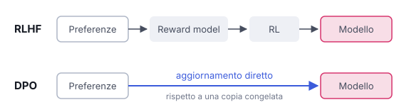

# IT

## In una frase

La DPO usa le stesse coppie di preferenze dell'RLHF, ma salta il giudice separato e l'apprendimento per rinforzo: aggiorna il modello direttamente.

## Approfondimento

La DPO (direct preference optimization, ottimizzazione diretta delle preferenze) è stata proposta nel 2023. I suoi autori hanno dimostrato che l'obiettivo dell'RLHF si può riscrivere in forma più semplice. Il giudice separato non serve: è già implicito nel modello stesso.

Il funzionamento è diretto. Per ogni domanda c'è una risposta preferita e una scartata. L'addestramento aumenta il distacco tra la probabilità che il modello dà alla preferita e quella che dà alla scartata, misurato rispetto a una copia congelata del modello di partenza. Questo confronto con il **modello di riferimento** fa il lavoro della penalità dell'RLHF: impedisce al modello di allontanarsi troppo.

Il vantaggio è pratico: meno modelli in memoria, un addestramento più stabile ed economico. Per questo la DPO e le sue varianti sono molto diffuse nei modelli aperti. Il limite: impara solo dalle coppie già raccolte, senza esplorare risposte nuove. Se i dati sono pochi o di parte, lo sarà anche il risultato.

## Nella vita di tutti i giorni

L'insegnante di italiano restituisce due compiti dello stesso studente sulla stessa traccia. Su uno scrive "più così", sull'altro "così no". Niente voti, nessun commissario esterno. Lo studente mette a confronto le due versioni e capisce da che parte spostarsi. Però impara solo da ciò che ha già scritto: se non ha mai provato un certo stile, nessuno glielo indicherà.

## Errore comune

Si dice che la DPO faccia a meno delle preferenze umane. Falso: richiede le stesse coppie "meglio/peggio" dell'RLHF. Elimina il modello giudice separato e il ciclo di rinforzo, non i dati di preferenza.

## Didascalia della figura

L'RLHF passa da un reward model e dall'apprendimento per rinforzo, mentre la DPO usa le stesse preferenze per aggiornare il modello direttamente.

# EN

## One line

DPO uses the same preference pairs as RLHF but skips the separate judge and the reinforcement learning loop, updating the model directly.

## Deep dive

DPO (direct preference optimization) was proposed in 2023. Its authors showed that the RLHF objective can be rewritten in a simpler form. A separate judge isn't needed: it is already implicit in the model itself.

The method is direct. Each prompt comes with a preferred answer and a rejected one. Training widens the gap between the probability the model gives the preferred answer and the one it gives the rejected answer, measured against a frozen copy of the starting model. That comparison with the **reference model** does the job of the RLHF penalty: it stops the model from drifting too far.

The benefit is practical: fewer models in memory, and training that is more stable and cheaper. That is why DPO and its variants are widely used for open models. The limit: it learns only from pairs already collected and never explores new answers. If the data is thin or skewed, so is the result.

## In everyday life

A writing teacher hands back two essays by the same student on the same topic. One says "more like this", the other "not like this". No grades, no outside examiner. The student compares the two and sees which way to move. But he only learns from what he has already written: if he never tried a certain style, nobody will point him towards it.

## Common mistake

A common claim is that DPO does away with human preferences. It doesn't: it needs the same better/worse pairs as RLHF. What it removes is the separate reward model and the reinforcement loop, not the preference data.

## Figure caption

RLHF goes through a reward model and reinforcement learning, while DPO uses the same preferences to update the model directly.
