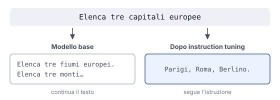

# IT

## In una frase

L'instruction tuning insegna a un modello base a seguire richieste, allenandolo su molti esempi di istruzione seguita dalla risposta giusta.

## Approfondimento

Un modello appena uscito dal pre-training sa solo continuare un testo. Se gli scrivi "Elenca tre capitali europee", potrebbe aggiungere altre domande simili, come in una scheda di esercizi. L'**instruction tuning** è un fine-tuning supervisionato su coppie istruzione-risposta: riassumi questo, traduci quello, rispondi a questa domanda, scrivi una mail.

La scoperta importante è che la varietà conta. Allenato su tanti tipi di compito diversi, il modello generalizza: segue bene anche istruzioni che non ha mai visto. Spesso basta un insieme di dati relativamente piccolo ma curato, perché il modello non impara cose nuove sul mondo. Impara la forma della conversazione e il ruolo di assistente.

Di solito è il primo passo dopo il pre-training, prima di RLHF o DPO. Il limite è che il modello imita gli esempi. Se sono scritti male, troppo sicuri di sé o sbagliati, copierà anche quello.

## Esempio for dummies

Un ragazzo ha letto tutti i libri di cucina della biblioteca, ma il primo giorno al bar resta immobile quando un cliente chiede "un macchiato, per favore". Il titolare gli fa vedere decine di ordinazioni, ognuna con la risposta giusta. Dopo una settimana gestisce anche richieste mai sentite, come un cappuccino d'orzo tiepido. Il sapere c'era già. Mancava l'abitudine di servire.

## Errore comune

Si pensa che un modello capisca le istruzioni già dal pre-training. Un modello base completa testo e basta. Comportarsi da assistente, cioè rispondere invece di continuare, è un'abilità aggiunta dopo con l'instruction tuning.

## Didascalia della figura

Alla stessa richiesta il modello base continua il testo, quello dopo l'instruction tuning risponde.

# EN

## One line

Instruction tuning teaches a base model to follow requests by training it on many examples of an instruction paired with a good response.

## Deep dive

A model fresh from pre-training can only continue text. Type "List three European capitals" and it may add more similar questions, as if filling a worksheet. **Instruction tuning** is supervised fine-tuning on instruction-response pairs: summarise this, translate that, answer this question, draft an email.

The key finding is that variety matters. Trained on many different kinds of task, the model generalises and follows instructions it has never seen. A relatively small but carefully curated dataset is often enough, because the model isn't learning new facts about the world. It learns the shape of a conversation and the role of an assistant.

It is usually the first step after pre-training, before RLHF or DPO. The limit is that the model imitates its examples. If they are sloppy, overconfident or wrong, it copies that too.

## For dummies

A young man has read every cookbook in the library, but on his first day at a café he freezes when a customer asks for "a flat white, please". The owner walks him through dozens of orders, each with the right response. A week later he handles orders he has never heard, like an oat-milk decaf, extra hot. The knowledge was already there. What was missing was the habit of serving.

## Common mistake

People assume a model understands instructions straight out of pre-training. A base model just completes text. Acting as an assistant, answering rather than continuing, is a skill added afterwards through instruction tuning.

## Figure caption

Given the same request, the base model continues the text, while the instruction-tuned model answers it.
