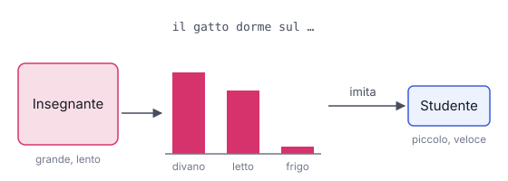

# IT

## In una frase

La distillazione allena un modello piccolo, lo studente, a imitare un modello grande, l'insegnante, per conservarne gran parte delle capacità a costo minore.

## Approfondimento

Un modello grande è bravo ma lento e costoso da usare. Nella **distillation** (distillazione) fa da insegnante. Lo studente, più piccolo, non impara solo la risposta giusta: impara l'intera distribuzione di probabilità dell'insegnante. Per esempio, che dopo "il gatto dorme sul" la parola "divano" è probabile, "letto" quasi altrettanto, "frigorifero" improbabile.

Queste "etichette morbide" contengono più informazione di una sola risposta corretta, quindi lo studente impara più in fretta e meglio. L'idea è stata formalizzata nel 2015. Oggi è comune anche una variante più semplice: l'insegnante genera molti testi e lo studente viene allenato su quelli.

Il risultato è un modello più rapido ed economico, che può girare anche su telefoni e portatili. Il limite: lo studente ha meno capacità e perde soprattutto sui compiti difficili o rari. Eredita anche gli errori dell'insegnante. Attenzione alle licenze: alcuni fornitori vietano di usare le uscite dei loro modelli per allenarne altri.

## Esempio for dummies

Un maestro di scacchi gioca con un allievo e, a ogni mossa, non indica solo la migliore. Aggiunge: "questa è quasi altrettanto buona, quest'altra è un disastro". L'allievo assorbe il modo di giudicare del maestro, non solo le mosse giuste, e migliora in fretta. Non lo raggiungerà nelle posizioni più complicate, ma per le partite di tutti i giorni basta e avanza.

## Errore comune

Spesso si confonde la distillazione con la quantizzazione. La quantizzazione comprime lo stesso modello. La distillazione allena un modello diverso e più piccolo, con meno parametri, che impara dal primo e di solito ne perde una parte delle capacità.

## Didascalia della figura

Lo studente impara a riprodurre l'intera distribuzione di probabilità dell'insegnante, non solo la risposta più probabile.

# EN

## One line

Distillation trains a small model, the student, to imitate a large one, the teacher, keeping much of its ability at a fraction of the cost.

## Deep dive

A large model is capable but slow and expensive to run. In **distillation** it acts as the teacher. The smaller student doesn't learn just the right answer: it learns the teacher's whole probability distribution. For example, that after "the cat is sleeping on the" the word "sofa" is likely, "bed" nearly as likely, and "fridge" unlikely.

These "soft labels" carry more information than a single correct answer, so the student learns faster and better. The idea was formalised in 2015. A simpler variant is common today: the teacher generates lots of text and the student is trained on it.

The result is a faster, cheaper model that can even run on phones and laptops. The limit: the student has less capacity and loses most on hard or rare tasks. It also inherits the teacher's mistakes. Watch the licences too: some providers forbid using their models' outputs to train other models.

## For dummies

A chess master plays with a pupil and, at every move, doesn't only name the best one. He adds: "this one is nearly as good, that one is a disaster". The pupil absorbs the master's judgement, not just the right moves, and improves quickly. He won't match the master in the trickiest positions, but for everyday games he is more than good enough.

## Common mistake

Distillation is often confused with quantization. Quantization compresses the same model. Distillation trains a different, smaller model with fewer parameters, which learns from the first one and usually loses some of its ability.

## Figure caption

The student learns to reproduce the teacher's whole probability distribution, not just its top answer.
