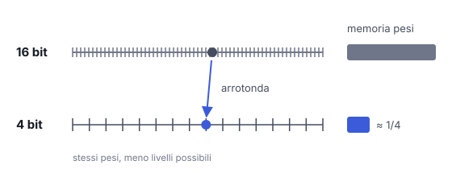

# IT

## In una frase

La quantizzazione salva i pesi del modello con meno bit, per esempio 4 invece di 16, riducendo memoria e costi con una piccola perdita di precisione.

## Approfondimento

Ogni peso di un modello è un numero, di solito salvato con 16 bit. La **quantization** (quantizzazione) lo arrotonda su una scala più grossolana: 8 bit, 4 bit, a volte meno. Passando da 16 a 4 bit, la memoria occupata dai pesi scende di circa quattro volte. Un modello che prima richiedeva un server può entrare in una scheda grafica da casa.

Anche la velocità migliora. Generare testo è spesso limitato da quanto in fretta si leggono i pesi dalla memoria, non dai calcoli. Meno byte da spostare significa risposte più rapide. Quasi sempre si quantizza un modello già addestrato. Esiste anche un addestramento che tiene conto della quantizzazione fin dall'inizio, più costoso ma più preciso.

Il compromesso è la precisione. A 8 bit la perdita è di solito minima. A 4 bit resta spesso accettabile, con metodi che trattano con cura i valori più delicati. Sotto quella soglia la qualità può crollare, e i modelli piccoli soffrono più di quelli grandi.

## Esempio for dummies

La ricetta della nonna dice 237 grammi di farina e 52 di zucchero. La nipote la ricopia sul quaderno arrotondando: 240 e 50. La torta viene praticamente uguale e il quaderno è più facile da leggere. Se però arrotondasse all'etto, scriverebbe 200 e 100. Lo zucchero raddoppia e la torta cambia sapore. Arrotondare va bene, finché la grana non diventa troppo grossa.

## Errore comune

Si crede che la quantizzazione tolga parametri al modello. Il numero di pesi resta identico: cambia solo quanti bit servono per scriverne ciascuno. Togliere pesi è un'altra tecnica, il pruning; allenare un modello più piccolo è la distillazione.

## Didascalia della figura

Con meno bit ogni peso viene arrotondato al livello più vicino di una scala più grossolana, e la memoria scende.

# EN

## One line

Quantization stores a model's weights with fewer bits, say 4 instead of 16, cutting memory and cost at a small loss of precision.

## Deep dive

Each weight in a model is a number, usually stored in 16 bits. **Quantization** rounds it onto a coarser scale: 8 bits, 4 bits, sometimes less. Going from 16 to 4 bits cuts the memory taken by the weights by about four times. A model that once needed a server can fit on a home graphics card.

Speed improves too. Generating text is often limited by how fast the weights can be read from memory, not by the arithmetic. Fewer bytes to move means faster answers. Most often a finished model is quantized after training. Quantization-aware training also exists: it accounts for the rounding from the start, costs more and keeps more accuracy.

The trade-off is precision. At 8 bits the loss is usually minimal. At 4 bits it is often acceptable, with methods that handle the most sensitive values carefully. Below that, quality can collapse, and small models suffer more than large ones.

## For dummies

Grandma's recipe says 237 grams of flour and 52 of sugar. Her grandson copies it into his notebook, rounding to 240 and 50. The cake comes out practically the same and the notebook is easier to read. Round to the nearest hundred grams, though, and it says 200 and 100. The sugar has doubled and the cake tastes different. Rounding is fine until the steps get too coarse.

## Common mistake

People believe quantization removes parameters from the model. The number of weights stays exactly the same; only the bits used to write each one change. Removing weights is a different technique, pruning, and training a smaller model is distillation.

## Figure caption

With fewer bits each weight is rounded to the nearest level of a coarser scale, and memory use drops.
