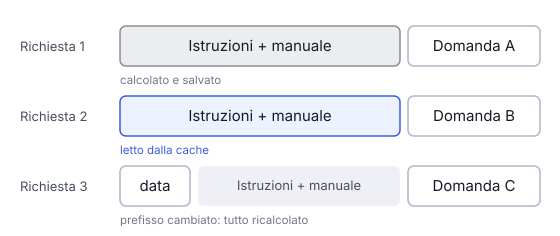

# IT

## In una frase

Il prompt caching riusa il lavoro già fatto su un inizio di prompt identico, così le richieste ripetute costano meno e partono prima.

## Approfondimento

Prima di scrivere la risposta, il modello legge tutto il prompt e calcola uno stato interno per ogni token, cioè ogni pezzetto di testo che elabora. Se molte richieste iniziano con lo stesso testo, per esempio lunghe istruzioni di sistema o un manuale, quel calcolo si ripete uguale ogni volta. Con il **prompt caching** il fornitore salva lo stato di quell'inizio comune, detto prefisso, e lo riusa.

La corrispondenza deve essere esatta, token per token, dall'inizio. Basta una data o un nome utente in testa al prompt e tutto quello che segue non è più riusabile. Per questo si mette prima la parte stabile e in fondo la parte variabile, come la domanda dell'utente.

Il guadagno è reale: i token letti dalla cache costano molto meno e la risposta parte prima. Ma la cache dura poco, di solito minuti, ed è legata a un solo modello. Con alcuni fornitori la prima scrittura in cache costa un po' di più dell'input normale, quindi conviene solo se il prefisso si ripete davvero.

## Esempio for dummies

Una pasticceria prepara ogni mattina la stessa base per le torte: pan di Spagna, crema, bagna. Quando arriva un ordine, il pasticcere aggiunge solo la decorazione richiesta. Se un cliente vuole un impasto diverso, però, la base pronta non serve più e si riparte da zero. Il prompt caching funziona così: la base comune è il prefisso, la decorazione è la domanda nuova. Cambiare un dettaglio all'inizio butta via tutto il lavoro pronto.

## Errore comune

Molti pensano che il prompt caching salvi le risposte e le restituisca a domande simili. Non è così: salva il calcolo sul prompt, solo per un inizio identico. La risposta viene sempre generata di nuovo.

## Didascalia della figura

Con lo stesso prefisso il calcolo viene riletto dalla cache; una data messa in testa cambia il prefisso e obbliga a ricalcolare tutto.

# EN

## One line

Prompt caching reuses the work already done on an identical prompt opening, so repeated requests cost less and start answering sooner.

## Deep dive

Before writing an answer, the model reads the whole prompt and computes an internal state for every token, the small chunk of text it processes. When many requests start with the same text, such as long system instructions or a manual, that work is repeated identically each time. With **prompt caching** the provider stores the state for that shared opening, called the prefix, and reuses it.

The match must be exact, token by token, from the very start. One date or user name near the top and everything after it can no longer be reused. So the stable part goes first and the variable part, like the user's question, goes last.

The gain is real: cached tokens are billed at a fraction of the normal price and the answer starts sooner. But the cache is short-lived, usually minutes, and tied to one model. With some providers the first write costs a bit more than normal input, so it only pays off when the prefix really repeats.

## For dummies

A bakery prepares the same cake base every morning: sponge, cream, syrup. When an order comes in, the baker only adds the requested decoration. If a customer wants a different sponge, though, the ready base is useless and work starts from scratch. Prompt caching works the same way. The shared base is the prefix, the decoration is the new question. Change one detail at the start and all the ready work is lost.

## Common mistake

Many think prompt caching stores answers and returns them for similar questions. It does not. It stores the computation on the prompt, only for an identical opening, and the answer is always generated fresh.

## Figure caption

With the same prefix the work is read back from the cache; a date placed at the top changes the prefix and forces a full recompute.
