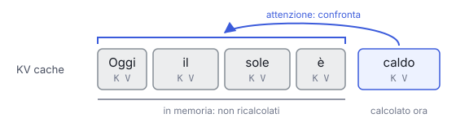

# IT

## In una frase

La KV cache conserva i calcoli sui token già letti, così il modello genera ogni nuova parola senza rileggere tutto da capo.

## Approfondimento

Un modello linguistico scrive un token alla volta. Per scegliere il prossimo, il meccanismo di attenzione confronta il token nuovo con tutti i precedenti. Per ogni token passato usa due vettori, chiamati key e value. La **KV cache** li tiene in memoria, per ogni strato del modello: a ogni passo si calcolano solo quelli del token nuovo, non quelli di tutto il testo.

Così la generazione diventa molto più veloce. Questo spiega anche le due fasi di una richiesta: prima il modello legge tutto il prompt in parallelo (prefill), poi scrive un token alla volta (decoding), riusando la cache.

Il prezzo è la memoria. La cache cresce con la lunghezza del testo e con il numero di utenti serviti insieme, e sta nella memoria della GPU, che è limitata. È uno dei motivi per cui i contesti molto lunghi costano. La KV cache vive dentro una singola richiesta. Il prompt caching (vedi Prompt Caching) la conserva tra richieste diverse.

## Nella vita di tutti i giorni

A una partita di basket, il telecronista non riguarda tutta la partita prima di commentare ogni azione. Tiene un taccuino: punteggio, falli, chi è in forma. A ogni nuova azione aggiunge una riga e commenta con il taccuino aperto. La KV cache è quel taccuino. Più dura la partita, più il taccuino si riempie, e a un certo punto le pagine finiscono.

## Errore comune

Si pensa che la KV cache sia una memoria del modello tra una conversazione e l'altra. In realtà è un deposito temporaneo di calcoli. Il modello non impara nulla: i suoi pesi restano identici.

## Didascalia della figura

A ogni passo si calcolano key e value solo del token nuovo, che si confronta con quelli già in cache.

# EN

## One line

The KV cache keeps the computations for tokens already processed, so the model can produce each new word without rereading everything from scratch.

## Deep dive

A language model writes one token at a time. To pick the next one, the attention mechanism compares the new token with all the previous ones. For each past token it uses two vectors, called key and value. The **KV cache** keeps them in memory, for every layer of the model, so each step only computes the vectors for the new token, not for the whole text.

This makes generation much faster. It also explains the two phases of a request: first the model reads the whole prompt in parallel (prefill), then it writes one token at a time (decoding), reusing the cache.

The price is memory. The cache grows with text length and with the number of users served at once, and it sits in GPU memory, which is limited. That is one reason very long contexts are expensive. The KV cache lives inside one request. Prompt caching (see Prompt Caching) keeps it across requests.

## In everyday life

A basketball commentator does not rewatch the whole game before describing each play. He keeps a notebook: score, fouls, who is playing well. With every new play he adds a line and speaks with the notebook open. The KV cache is that notebook. The longer the game, the fuller it gets, and at some point the pages run out.

## Common mistake

People often think the KV cache is the model's memory across conversations. It is actually temporary storage of computations. The model learns nothing from it: its weights stay exactly the same.

## Figure caption

At each step only the new token's key and value are computed, and it is compared with those already in the cache.
