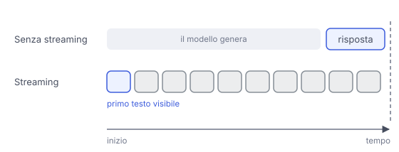

# IT

## In una frase

Lo streaming invia la risposta un pezzo alla volta, mentre viene generata, invece di aspettare che sia completa.

## Approfondimento

Il modello produce comunque un token alla volta. Senza streaming, il server aspetta la fine e poi manda tutto. Con lo **streaming** manda ogni pezzo appena è pronto, di solito su una connessione che resta aperta e riceve eventi in sequenza.

Il tempo totale cambia poco. Cambia il tempo percepito: il primo testo compare presto e l'utente può iniziare a leggere. Per questo si misura il tempo al primo token, separato dal tempo totale. Lo streaming permette anche di fermare presto una risposta sbagliata ed evita i timeout sulle risposte lunghe.

Ha dei costi per chi costruisce l'applicazione. Bisogna ricomporre i pezzi, gestire una connessione che cade a metà e controllare un testo non ancora finito. Un filtro di sicurezza che legge solo la risposta completa arriva tardi: l'utente l'ha già vista. E un JSON a metà non è ancora valido.

## Nella vita di tutti i giorni

Al telefono, un amico ti detta una ricetta. Potrebbe scriverla tutta e mandartela dopo dieci minuti, oppure leggertela riga per riga. Nel secondo caso inizi subito a preparare gli ingredienti, anche se la ricetta finisce alla stessa ora. Però, se a metà cade la linea, ti resta mezza ricetta e devi capire dove eri arrivato.

## Errore comune

Molti credono che lo streaming renda il modello più veloce. Non è così: il tempo per generare tutta la risposta resta quasi uguale. Si riduce l'attesa prima di vedere il primo testo.

## Didascalia della figura

Il modello impiega lo stesso tempo, ma con lo streaming il primo testo arriva all'utente quasi subito.

# EN

## One line

Streaming sends the answer piece by piece as it is generated, instead of waiting until it is complete.

## Deep dive

The model produces one token at a time anyway. Without streaming, the server waits for the end and then sends everything. With **streaming** it sends each piece as soon as it is ready, usually over a connection that stays open and receives events in sequence.

Total time barely changes. Perceived time does: the first text appears quickly and the user can start reading. That is why time to first token is measured separately from total time. Streaming also lets you stop a bad answer early and avoids timeouts on long ones.

It has costs for whoever builds the application. You have to reassemble the pieces, handle a connection that drops halfway, and check text that is not finished yet. A safety filter that only reads the complete answer comes too late: the user has already seen it. And half a JSON object is not valid JSON yet.

## In everyday life

A friend is giving you a recipe over the phone. He could write it all out and send it ten minutes later, or read it to you line by line. In the second case you start getting the ingredients ready right away, even though the recipe ends at the same time. But if the line drops halfway, you are left with half a recipe and must work out where you stopped.

## Common mistake

Many believe streaming makes the model faster. It does not: the time to generate the full answer stays about the same. What shrinks is the wait before the first text appears.

## Figure caption

The model takes the same time, but with streaming the first text reaches the user almost at once.
