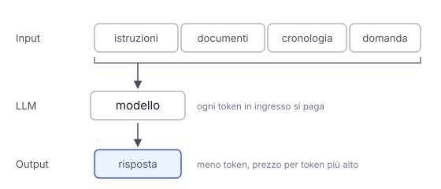

# IT

## In una frase

Costo e latenza dipendono soprattutto da quanti token entrano, quanti escono e da quale modello li elabora.

## Approfondimento

Le API dei modelli si pagano a token, con due prezzi: uno per l'input e uno, di solito più alto, per l'output. La **latenza**, cioè il tempo di attesa, ha due parti: il tempo al primo token, che cresce con la lunghezza del prompt, e la velocità di scrittura, che pesa su ogni token generato. Un modello più grande è in genere più lento e più caro per token.

Le leve principali sono poche. Scegliere il modello più piccolo che supera i propri test. Accorciare il prompt e chiedere risposte brevi. Usare il prompt caching per le parti ripetute. Molti fornitori fanno uno sconto sui lavori in batch, che possono aspettare ore invece di secondi. Mandare le domande facili a un modello piccolo e quelle difficili a uno grande.

Ogni leva ha un prezzo. Un modello piccolo può essere meno affidabile sui compiti complessi. I modelli che ragionano a lungo prima di rispondere producono molti token che non vedi ma paghi. Il numero giusto non è il costo per chiamata ma il costo per compito riuscito, tentativi falliti compresi.

## Nella vita di tutti i giorni

All'ufficio postale il costo di una spedizione dipende dal peso e dalla velocità scelta. Una raccomandata urgente arriva prima ma costa di più. Un pacco ordinario costa poco ma arriva tra giorni. Chi spedisce tanto impara a scegliere: posta veloce solo per ciò che corre, invii raggruppati per il resto. E conta il costo per pacco arrivato: una spedizione economica che si perde e va rifatta costa il doppio.

## Errore comune

Si pensa che il prezzo dipenda dalla lunghezza della domanda. Conta tutto ciò che entra, incluse istruzioni, documenti e cronologia della chat, e conta ciò che esce, di solito pagato di più.

## Didascalia della figura

Si paga tutto ciò che entra, non solo la domanda, e ciò che esce costa di più per token.

# EN

## One line

Cost and latency depend mostly on how many tokens go in, how many come out, and which model processes them.

## Deep dive

Model APIs charge per token, with two prices: one for input and one, usually higher, for output. **Latency**, the waiting time, has two parts: time to first token, which grows with prompt length, and writing speed, which applies to every token generated. A bigger model is usually slower and more expensive per token.

The main levers are few. Pick the smallest model that passes your tests. Shorten the prompt and ask for short answers. Use prompt caching for repeated parts. Many providers discount batch jobs that can wait hours instead of seconds. Route easy questions to a small model and hard ones to a large one.

Each lever has a price. A small model can be less reliable on complex tasks. Models that reason at length before answering produce many tokens you may not see but still pay for. The number that matters is not cost per call but cost per successful task, failed attempts included.

## In everyday life

At the post office, the price of a shipment depends on weight and speed. Express arrives sooner but costs more. Standard is cheap but takes days. People who ship a lot learn to choose: express only for what is urgent, grouped shipments for the rest. And what counts is the cost per parcel delivered: a cheap shipment that gets lost and must be resent costs twice.

## Common mistake

People think the price depends on how long the question is. Everything that goes in counts, including instructions, documents and chat history, and so does everything that comes out, usually at a higher price.

## Figure caption

You pay for everything that goes in, not just the question, and what comes out costs more per token.
