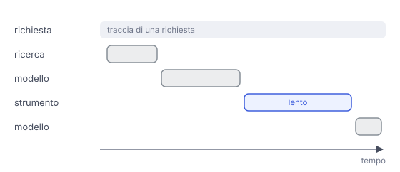

# IT

## In una frase

L'osservabilità registra cosa entra, cosa esce e cosa succede a ogni passo di un sistema AI, per capire errori, costi e tempi.

## Approfondimento

Un sistema basato su un modello linguistico non dà errore quando sbaglia: risponde con sicurezza e sembra tutto a posto. Per capire cosa succede bisogna registrare ogni chiamata: prompt completo, risposta, modello e versione, token usati, tempo, costo. In un'applicazione con più passi, come un agente che usa strumenti, queste registrazioni si collegano in una **traccia** (trace), che mostra la catena di passi dietro una singola richiesta.

Con le tracce si risponde a domande concrete. Perché questa risposta è sbagliata: il documento giusto non è stato trovato o il modello l'ha ignorato? Dove si perde tempo? Quale funzione costa di più? Le tracce reali sono anche la materia prima per costruire buoni test (vedi Evals & Benchmarks).

Il limite è che registrare tutto significa conservare i testi degli utenti, a volte con dati personali. Servono regole su cosa salvare, per quanto tempo e chi può leggerlo. E i dati da soli non bastano: qualcuno deve leggerli.

## Nella vita di tutti i giorni

In una cucina di ristorante ogni comanda ha un foglietto: chi ha ordinato, a che ora è entrata, chi ha cucinato ogni portata, quando è uscita. Se un cliente si lamenta di un piatto freddo, lo chef guarda il foglietto e vede dove si è fermato: ai fornelli o in attesa del cameriere. Senza foglietti restano solo un piatto freddo e tante ipotesi.

## Errore comune

Si pensa che basti controllare che il servizio sia attivo e risponda in fretta. Un sistema AI può rispondere veloce e senza errori tecnici, ma dire una cosa sbagliata. Bisogna registrare i contenuti e leggerli davvero.

## Didascalia della figura

Una traccia mostra i passi di una singola richiesta nel tempo e rivela quale passo rallenta o sbaglia.

# EN

## One line

Observability records what goes in, what comes out and what happens at each step of an AI system, to understand errors, costs and timing.

## Deep dive

A system built on a language model does not throw an error when it is wrong: it answers confidently and everything looks fine. To see what is happening you need to log every call: full prompt, response, model and version, tokens used, time, cost. In a multi-step application, such as an agent that uses tools, these records are linked into a **trace**, which shows the chain of steps behind one request.

Traces let you answer concrete questions. Why is this answer wrong: was the right document not found, or did the model ignore it? Where is the time going? Which feature costs the most? Real traces are also the raw material for good tests (see Evals & Benchmarks).

The catch is that logging everything means storing users' text, sometimes with personal data. You need rules on what to keep, for how long, and who can read it. And data alone is not enough: someone has to read it.

## In everyday life

In a restaurant kitchen every order gets a ticket: who ordered, when it came in, who cooked each dish, when it went out. If a guest complains about a cold plate, the chef checks the ticket and sees where it stalled: at the stove or waiting for a waiter. Without tickets there is only a cold plate and a lot of guesses.

## Common mistake

People think it is enough to check that the service is up and responding quickly. An AI system can answer fast, with no technical errors, and still be wrong. You need to log the content and actually read it.

## Figure caption

A trace shows the steps of a single request over time and reveals which step is slow or wrong.
