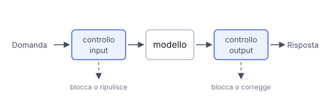

# IT

## In una frase

I guardrail sono controlli attorno al modello che bloccano o correggono input e output inaccettabili prima che facciano danni.

## Approfondimento

Un modello addestrato a comportarsi bene a volte sbaglia comunque. I **guardrail** sono uno strato separato di controlli, in entrata e in uscita. In entrata: filtrare richieste fuori tema o abusive, togliere i dati personali. In uscita: verificare il formato, cercare parole vietate, controllare che la risposta citi le fonti fornite. Possono essere semplici regole nel codice o un secondo modello che classifica il testo.

Contano anche i limiti sulle azioni, non solo sul testo. Se il sistema può mandare email o modificare dati, conviene limitare cosa può fare e chiedere una conferma umana per i passi rischiosi.

Il compromesso è tra sicurezza e utilità. Controlli troppo severi bloccano richieste legittime e irritano gli utenti. Quelli troppo larghi lasciano passare errori. Ogni controllo aggiunge anche tempo e costo. Nessun guardrail è perfetto: se ne usano diversi, a strati, e si misura quanti falsi allarmi e quanti errori mancati producono.

## Nella vita di tutti i giorni

In piscina il bagnino non insegna a nuotare: sorveglia. Vieta i tuffi dove l'acqua è bassa, fischia se qualcuno esagera, tiene i bambini lontani dalle corsie profonde. Se fischia troppo spesso la gente se ne va. Se si distrae succede un incidente. E anche con il bagnino migliore, il bordo dove l'acqua è bassa ha comunque il suo cartello.

## Errore comune

Si pensa che basti scrivere nel prompt "non fare mai X". Un'istruzione nel prompt aiuta, ma il modello può ignorarla o essere convinto a cambiare idea. Un guardrail vero è un controllo esterno, nel codice o in un altro modello.

## Didascalia della figura

I controlli stanno fuori dal modello, prima e dopo: possono bloccare o correggere ciò che passa.

# EN

## One line

Guardrails are checks placed around the model that block or fix unacceptable inputs and outputs before they cause harm.

## Deep dive

A model trained to behave well still makes mistakes sometimes. **Guardrails** are a separate layer of checks, on the way in and on the way out. On input: filter off-topic or abusive requests, strip personal data. On output: check the format, look for banned words, verify that the answer cites the sources it was given. They can be plain rules in code or a second model that classifies the text.

Limits on actions matter as much as limits on text. If the system can send emails or change data, restrict what it may do and ask a human to confirm risky steps.

The trade-off is safety against usefulness. Checks that are too strict block legitimate requests and annoy users. Checks that are too loose let errors through. Every check also adds time and cost. No guardrail is perfect, so you stack several and measure how many false alarms and missed errors they produce.

## In everyday life

A lifeguard at the pool does not teach swimming: he watches. He bans diving where the water is shallow, whistles when someone gets reckless, and keeps children out of the deep lanes. Whistle too often and people leave. Look away and there is an accident. And even with the best lifeguard, the shallow end still has its warning sign.

## Common mistake

People think writing "never do X" in the prompt is enough. A prompt instruction helps, but the model can ignore it or be talked out of it. A real guardrail is an external check, in code or in a separate model.

## Figure caption

The checks sit outside the model, before and after it: they can block or fix what passes through.
