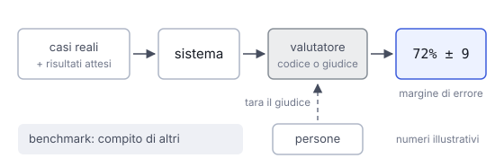

# IT

## In una frase

Un eval misura se il tuo sistema fa bene il tuo compito, mentre un benchmark confronta modelli su un compito standard, uguale per tutti.

## Approfondimento

Un **eval** ha tre parti: una raccolta di casi reali con il risultato atteso, il sistema da provare e un valutatore che dà un voto. Il valutatore può essere codice, per tutto ciò che ha una risposta certa (categoria giusta, formato, lunghezza), oppure un altro modello che fa da giudice per le qualità più sfumate. Prima di scrivere i valutatori conviene leggere a mano decine di risposte e annotare i tipi di errore.

Un giudice automatico va controllato come qualsiasi strumento: si confrontano i suoi voti con quelli di persone sugli stessi casi. Ha anche preferenze note, per esempio per le risposte più lunghe. E ogni risultato va letto con il suo margine di errore: con poche decine di casi, una differenza di pochi punti può essere solo rumore.

I **benchmark** pubblici servono a fare una prima selezione tra modelli. Però si saturano, possono finire nei dati di addestramento e misurano un compito che non è il tuo. La scelta finale va fatta con il tuo eval.

## Nella vita di tutti i giorni

Per assumere un cuoco, un ristorante non guarda solo le medaglie vinte alle gare nazionali: quelle sono i benchmark. Gli fa cucinare i dieci piatti del proprio menù e li serve a clienti abituali che danno un voto: quello è l'eval. E se a votare è un critico, il proprietario controlla prima che i suoi gusti coincidano con quelli dei clienti.

## Errore comune

Si pensa che il modello in cima alle classifiche sia il migliore per il proprio caso. Un punteggio di benchmark dipende da compito, prompt e modo di misurare. Sul tuo compito l'ordine può cambiare: va verificato con un tuo eval.

## Didascalia della figura

Un eval passa casi reali al sistema, li fa valutare e dà un numero con il suo margine di errore, e il giudice va tarato su voti umani.

# EN

## One line

An eval measures whether your system does your task well, while a benchmark compares models on a standard task that is the same for everyone.

## Deep dive

An **eval** has three parts: a set of real cases with the expected result, the system under test, and a grader that gives a score. The grader can be code, for anything with a definite answer (right category, format, length), or another model acting as a judge for fuzzier qualities. Before writing graders, read dozens of outputs by hand and note the kinds of errors.

A model judge must be checked like any instrument: compare its scores with human ones on the same cases. It also has known biases, for example toward longer answers. And every result should come with its margin of error: with a few dozen cases, a gap of a few points may be just noise.

Public **benchmarks** help make a first shortlist of models. But they saturate, can leak into training data, and measure a task that is not yours. The final choice should come from your own eval.

## In everyday life

When hiring a cook, a restaurant does not just look at medals from national contests: those are benchmarks. It has the candidate cook the ten dishes on its own menu and serves them to regular guests who score them: that is the eval. And if a critic does the scoring, the owner first checks that the critic's taste matches the guests'.

## Common mistake

People assume the model at the top of the leaderboard is the best for their case. A benchmark score depends on the task, the prompt and the test setup. On your task the ranking can change, so check it with your own eval.

## Figure caption

An eval runs real cases through the system, grades them and gives one number with its margin of error, and the judge is calibrated on human scores.
