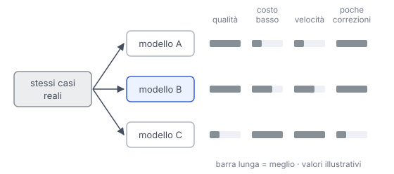

# IT

## In una frase

Per scegliere un modello conviene provarne due o tre sugli stessi casi reali e confrontare qualità, costo, tempo e lavoro di correzione.

## Approfondimento

Le classifiche pubbliche aiutano a fare una prima selezione, ma misurano compiti generici, non il tuo. Il metodo pratico è raccogliere qualche decina di casi veri, per esempio richieste arrivate davvero dagli utenti, e darli a due o tre modelli candidati, con lo stesso prompt o con piccoli adattamenti per ciascuno.

Poi si confrontano quattro cose. La qualità: quante risposte sono buone. Il costo per compito, che dipende anche da quanti token ogni modello produce, non solo dal prezzo per token. Il tempo di risposta. E il **lavoro di correzione**: quanto serve a una persona per sistemare le risposte quasi giuste. Un modello più economico che richiede molte correzioni può costare di più.

Due cautele. Le risposte cambiano da una prova all'altra, quindi conviene ripetere i casi più importanti. E un modello grande non è sempre necessario: per compiti semplici spesso basta uno piccolo e veloce. Quando escono modelli nuovi si rifà il confronto sugli stessi casi.

## Esempio for dummies

Per comprare scarpe da corsa non ti fidi solo della classifica di una rivista. Ne provi due o tre paia in negozio, sul tapis roulant, con le calze che usi di solito. Guardi come ti trovi, quanto costano e se ti fanno venire le vesciche, che poi devi curare tu. Il paio primo in classifica può non essere il migliore per il tuo piede.

## Errore comune

Scegliere il modello primo in classifica senza provarne altri. La classifica misura compiti di altri, e il primo può essere più grande e costoso di quanto serve. Solo una prova sui propri casi dice quale conviene davvero.

## Didascalia della figura

Gli stessi casi reali vanno a tre modelli, e il confronto guarda qualità, costo, tempo e correzioni, non solo la classifica.

# EN

## One line

To choose a model, try two or three on the same real cases and compare quality, cost, speed and correction effort.

## Deep dive

Public leaderboards help make a first shortlist, but they measure generic tasks, not yours. The practical method is to collect a few dozen real cases, for example requests users actually sent, and give them to two or three candidate models, with the same prompt or with small adjustments for each.

Then compare four things. Quality: how many answers are good. Cost per task, which also depends on how many tokens each model produces, not just on the price per token. Response time. And the **correction effort**: how long it takes a person to fix the answers that are almost right. A cheaper model that needs many fixes can end up costing more.

Two cautions. Answers vary from one run to the next, so repeat the most important cases. And a large model is not always needed: for simple tasks a small, fast one is often enough. When new models come out, rerun the comparison on the same cases.

## For dummies

When buying running shoes you do not just trust a magazine's ranking. You try two or three pairs in the shop, on the treadmill, with the socks you usually wear. You check how they feel, what they cost and whether they give you blisters, which you then have to treat yourself. The top-ranked pair may not be the best one for your feet.

## Common mistake

Picking the top model on a leaderboard without trying others. The leaderboard measures other people's tasks, and the top model may be bigger and costlier than you need. Only a test on your own cases shows which one is really worth it.

## Figure caption

The same real cases go to three models, and the comparison looks at quality, cost, time and corrections, not just the leaderboard.
