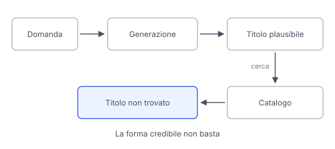

# IT

## In una frase

Un modello può produrre affermazioni false ma fluenti perché generare una continuazione plausibile non equivale a verificare un fatto.

## Approfondimento

Durante il pre-training, un modello linguistico impara a prevedere il prossimo token a partire dal testo precedente. Apprende regolarità del linguaggio e molte informazioni sul mondo. Quando risponde, però, la probabilità di un token misura quanto quel seguito si adatta al contesto secondo il modello. Non è la probabilità che l'intera affermazione sia vera. Una frase ben costruita può quindi contenere un nome sbagliato o collegare fatti che non vanno insieme.

Si parla di **allucinazione** quando il sistema presenta contenuti inventati o non sostenuti dalle informazioni disponibili come se fossero fatti. Può inventare il titolo di un libro, attribuire una frase all'autore sbagliato o aggiungere dettagli assenti da un documento. Anche una risposta in parte corretta può contenerne.

Addestramento mirato, documenti pertinenti e controlli esterni possono ridurre questi errori. Nessuno di questi accorgimenti garantisce ogni risposta. Per un fatto importante serve una verifica che aggiunga prove, non soltanto una formulazione più convincente.

## Nella vita di tutti i giorni

Chiedi il titolo di un romanzo ambientato in una biblioteca di montagna. L'assistente propone un titolo credibile, un autore e una breve trama. Tutti i dettagli si incastrano, ma nel catalogo della biblioteca non trovi una registrazione corrispondente. Il modello ha composto una risposta che assomiglia a una scheda bibliografica. Il riferimento resta non verificato. Prima di ordinare il libro, cerchi altre registrazioni e controlli che autore e titolo coincidano.

## Errore comune

Pensare che un errore così dettagliato sia una bugia deliberata. Il termine allucinazione descrive un risultato, non un'intenzione umana. La precisione apparente dei dettagli non dimostra che il modello li abbia verificati.

## Didascalia della figura

La generazione produce una frase plausibile, ma senza una registrazione corrispondente il riferimento resta non confermato.

# EN

## One line

A model can produce fluent false statements because generating a plausible continuation is different from checking a fact.

## Deep dive

During pre-training, a language model learns to predict the next token from the preceding text. It learns patterns in language and substantial information about the world. When it answers, however, a token's probability measures how well that continuation fits the context according to the model. It is not the probability that the whole statement is true. A well-formed sentence can therefore contain the wrong name or combine unrelated facts.

A **hallucination** occurs when the system presents invented content or content unsupported by the available information as fact. It might invent a book title, attribute a quotation to the wrong author or add details missing from a document. An otherwise correct answer can contain these errors too.

Targeted training, relevant documents and external checks can reduce such errors. None guarantees every answer. An important factual claim needs verification that adds evidence, not just more convincing wording.

## In everyday life

You ask for the title of a novel set in a mountain library. The assistant offers a plausible title, an author and a short plot. Everything fits together, but you cannot find a matching record in the library catalogue. The model has composed something resembling a book record. The reference remains unverified. Before ordering the book, you look for other records and check that the author and title match.

## Common mistake

Assuming that such a detailed error must be a deliberate lie. Hallucination describes an output, not a human intention. Apparently precise details do not establish that the model has checked them.

## Figure caption

Generation produces a plausible sentence, but without a matching record the reference remains unconfirmed.
