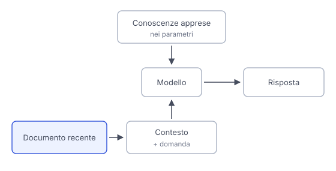

# IT

## In una frase

La data di aggiornamento indica un limite temporale dei dati di addestramento, non una garanzia di conoscere tutto ciò che viene prima.

## Approfondimento

Il **knowledge cutoff** è la data dichiarata fino alla quale arrivano i dati usati per addestrare un modello. È un riferimento sulla copertura temporale, non un archivio completo del passato. Un fatto precedente può mancare dai dati, essere stato appreso male o essere difficile da richiamare. Un fatto successivo non entra automaticamente nelle conoscenze apprese solo perché passa il tempo.

Per conoscere un cambiamento recente, il sistema può usare una ricerca o documenti forniti nella conversazione. Le informazioni recuperate entrano nel contesto della risposta. Consultare una pagina non aggiorna di per sé i parametri del modello. Il sistema può così rispondere su eventi successivi al cutoff usando fonti esterne, oppure dedurre qualcosa dai dati disponibili.

Il limite si sposta sulla qualità delle fonti e sul loro uso. Una pagina vecchia, un risultato irrilevante o una lettura sbagliata possono ancora produrre errori. Per orari e altri fatti variabili, controlla la data di validità e che la fonte sia stata davvero consultata.

## Esempio for dummies

Una guida turistica stampata descrive un museo e il suo vecchio orario. Il museo cambia giorno di chiusura dopo la stampa. La guida resta utile per la storia dell'edificio, ma non può registrare da sola il cambiamento. Un avviso recente del museo può completarla. Devi però leggere a quali giorni si applica: una comunicazione su una chiusura straordinaria non sostituisce necessariamente l'orario abituale.

## Errore comune

Credere che il cutoff renda vere tutte le risposte sul passato e impossibili quelle sul presente. La copertura del passato è incompleta. Informazioni recenti possono arrivare da strumenti o documenti, ma richiedono comunque controllo.

## Didascalia della figura

Un documento recente entra nel contesto insieme alla domanda e permette di usare informazioni successive al cutoff.

# EN

## One line

The knowledge cutoff marks a time boundary for training data, not a guarantee of knowing everything that came before it.

## Deep dive

The **knowledge cutoff** is the stated date up to which a model's training data extends. It describes temporal coverage, not a complete archive of the past. An earlier fact may be absent from the data, learned incorrectly or difficult to recall. A later fact does not automatically become learned knowledge just because time passes.

To learn about a recent change, the system can use search or documents supplied in the conversation. Retrieved information enters the answer's context. Reading a page does not itself update the model's parameters. The system can thus answer about events after its cutoff using external evidence, or infer something from the available data.

The limitation shifts to source quality and how sources are used. An old page, an irrelevant result or a misreading can still cause errors. For timetables and other changing facts, check the effective date and whether the source was actually consulted.

## For dummies

A printed travel guide describes a museum and its old opening hours. The museum changes its closing day after publication. The guide remains useful for the building's history, but cannot record the change by itself. A recent museum notice can supplement it. You still need to read which days it applies to: a notice about an exceptional closure does not necessarily replace the regular timetable.

## Common mistake

Believing the cutoff makes all answers about the past true and answers about the present impossible. Past coverage is incomplete. Recent information can come from tools or documents, but still needs checking.

## Figure caption

A recent document enters the context alongside the question, allowing the model to use information from after its cutoff.
