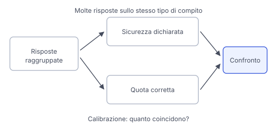

# IT

## In una frase

Il tono sicuro di una risposta non misura la sua affidabilità, e anche l'incertezza dichiarata va valutata con prove.

## Approfondimento

Un assistente può scrivere "certamente" davanti a un'affermazione falsa e "forse" davanti a una corretta. Queste parole fanno parte del testo generato. Possono riflettere segnali utili, ma dipendono anche dalle istruzioni e dagli stili appresi. Non sono un indicatore infallibile di ciò che il modello sa o non sa.

La **calibrazione** confronta la sicurezza dichiarata con la frequenza di risposte corrette su molti casi. Se un sistema assegna una certa probabilità di correttezza a un gruppo di risposte, quella quota dovrebbe corrispondere alla quota effettivamente corretta. Va misurata su domande rappresentative dell'uso previsto. Una buona calibrazione complessiva non certifica una singola risposta.

Chiedere "quali parti sono incerte e quali informazioni mancano?" può aiutare a individuare punti da verificare. Chiedi anche di distinguere fatti documentati, ipotesi e deduzioni. Resta un aiuto all'analisi: il modello può omettere un dubbio o inventarne uno. Una percentuale scritta nella chat, senza valutazioni pertinenti, non è una misura validata.

## Nella vita di tutti i giorni

Due amici ti spiegano come raggiungere una palestra. Il primo parla senza esitazioni, il secondo dice che una strada potrebbe essere chiusa. Il tono non basta per scegliere. Controlli la mappa e l'avviso sui lavori. Il dubbio del secondo amico ti ha indicato cosa verificare, ma non ha dimostrato da solo che la strada sia chiusa. Lo stesso vale per le cautele espresse da un assistente.

## Errore comune

Chiedere una percentuale di sicurezza e trattarla come un risultato misurato. È una stima generata, la cui utilità dipende dalla calibrazione nel compito specifico. Per una decisione importante, cerca prove a sostegno della risposta.

## Didascalia della figura

La calibrazione confronta sicurezza dichiarata e risultati verificati su un insieme di risposte, non il tono di una frase isolata.

# EN

## One line

An answer's confident tone does not measure its reliability, and expressed uncertainty also needs to be assessed against evidence.

## Deep dive

An assistant can write "certainly" before a false statement and "perhaps" before a correct one. These words are part of the generated text. They may reflect useful signals, but also depend on instructions and learned styles. They are not an infallible indicator of what the model knows or does not know.

**Calibration** compares stated confidence with the frequency of correct answers across many cases. If a system assigns a particular probability of correctness to a group of answers, that proportion should match the proportion actually correct. It must be measured on questions representative of the intended use. Good overall calibration does not certify an individual answer.

Asking "which parts are uncertain and what information is missing?" can help identify points to check. Also ask it to separate documented facts, assumptions and deductions. This remains an analytical aid: the model can miss an uncertainty or invent one. A percentage written in chat, without relevant evaluation, is not a validated measure.

## In everyday life

Two friends explain how to reach a gym. One speaks without hesitation, while the other says a road might be closed. Tone is not enough to choose between them. You check the map and the roadworks notice. The second friend's uncertainty suggested something to check, but did not by itself establish that the road was closed. The same applies to an assistant's expressions of caution.

## Common mistake

Asking for a confidence percentage and treating it as a measured result. It is a generated estimate whose usefulness depends on calibration for that task. For an important decision, seek evidence about the answer.

## Figure caption

Calibration compares stated confidence with verified outcomes across a set of answers, not the tone of an isolated sentence.
