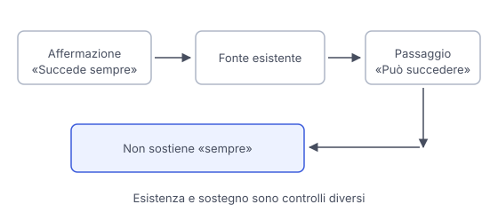

# IT

## In una frase

Una citazione rende una risposta controllabile solo se la fonte esiste, è pertinente e sostiene davvero l'affermazione a cui è collegata.

## Approfondimento

Un modello può generare una citazione nello stesso modo in cui genera il resto del testo. Un titolo credibile, un autore reale e un indirizzo ben formato possono combinarsi in un riferimento inesistente. Anche quando una ricerca recupera documenti veri, la risposta può collegare una fonte all'affermazione sbagliata. La presenza di un collegamento non conclude la verifica.

Controlla prima l'**esistenza**: apri il documento e confronta titolo, autore e data. Poi cerca il passaggio rilevante. Sostiene la frase precisa oppure parla soltanto dello stesso argomento? Un testo che descrive una possibilità non dimostra che quella possibilità si realizzi sempre. Una citazione letterale deve anche riportare fedelmente le parole e il loro contesto.

Infine valuta autorevolezza, attualità e limiti della fonte. Per un orario cerca chi gestisce il servizio, per un risultato di ricerca il lavoro originale. Se il documento non è accessibile, considera quel riferimento non verificato. La fonte stessa può comunque contenere errori o richiedere un confronto indipendente.

## Esempio for dummies

Per una gita scolastica chiedi se un museo offre laboratori ogni domenica. L'assistente cita una pagina del museo che esiste davvero. Aprendola scopri che il laboratorio era previsto per una sola domenica, durante una festa. Il collegamento era autentico, ma non sosteneva la regola generale. Prima di organizzare la visita controlli il calendario corrente e, se resta un dubbio, contatti il museo.

## Errore comune

Contare le citazioni come voti a favore della risposta. Molti riferimenti possono essere irrilevanti o ripetere la stessa notizia. Conta la qualità del collegamento tra ciascuna affermazione e le prove che la sostengono.

## Didascalia della figura

Il controllo passa dall'esistenza della fonte al passaggio preciso, distinguendo una possibilità da una conclusione dimostrata.

# EN

## One line

A citation makes an answer checkable only if the source exists, is relevant and actually supports the claim attached to it.

## Deep dive

A model can generate a citation just as it generates other text. A plausible title, a real author and a correctly formatted address can combine into a nonexistent reference. Even when search retrieves real documents, the answer may attach a source to the wrong claim. A link does not finish the checking process.

First check **existence**: open the document and compare its title, author and date. Then find the relevant passage. Does it support the precise statement, or merely discuss the same topic? A text describing a possibility does not establish that it always happens. A direct quotation must also faithfully reproduce the words and their context.

Finally assess the source's authority, currency and limitations. For a timetable, consult the service operator. For a research finding, consult the original study. If the document is inaccessible, treat that reference as unverified. The source itself may still contain errors or need independent corroboration.

## For dummies

For a school trip, you ask whether a museum runs workshops every Sunday. The assistant cites a genuine museum page. When you open it, you discover that the workshop was scheduled for just one Sunday during a festival. The link was authentic, but did not support the general rule. Before arranging the visit, you check the current calendar and contact the museum if anything remains unclear.

## Common mistake

Counting citations as votes in favour of the answer. Many references may be irrelevant or repeat the same report. What matters is the quality of the connection between each claim and the evidence supporting it.

## Figure caption

Checking moves from the source's existence to the precise passage, distinguishing a possibility from an established conclusion.
