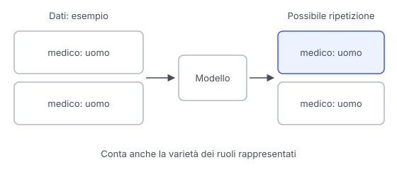

# IT

## In una frase

I modelli possono riprodurre o amplificare pregiudizi e squilibri presenti nei dati, nelle scelte di addestramento e nel contesto d'uso.

## Approfondimento

I dati di addestramento non rappresentano tutte le persone e le culture allo stesso modo. Alcune lingue compaiono spesso, altre poco. I testi possono associare ripetutamente certi ruoli a un genere o descrivere gruppi attraverso stereotipi. Imparando queste regolarità, un modello può riprodurre **pregiudizi** nelle risposte senza che qualcuno abbia scritto una regola esplicita per farlo.

Il problema non riguarda soltanto frasi offensive. Può apparire come una distribuzione ristretta di professioni nei racconti, esempi che escludono alcune famiglie o prestazioni peggiori in una lingua meno rappresentata. Oltre ai dati, contano le istruzioni, le preferenze dei valutatori e le decisioni su cosa misurare. Una singola risposta non basta a descrivere il comportamento generale.

Dati più rappresentativi, valutazioni su gruppi diversi e correzioni mirate possono ridurre i danni. Non esiste però una pulizia definitiva valida per ogni contesto: gli squilibri sono molti e i criteri di equità dipendono dall'uso. Servono controlli ripetuti, anche quando cambiano pubblico o compito, e persone capaci di riconoscere esclusioni sfuggite alle metriche.

## Nella vita di tutti i giorni

Una classe chiede racconti su persone che lavorano in ospedale. In molti racconti generati i medici sono uomini e chi assiste i pazienti è donna. Ogni singola storia potrebbe essere plausibile, ma la ripetizione restringe i ruoli rappresentati. L'insegnante confronta più testi e chiede personaggi più vari. Questo migliora il materiale della lezione, senza dimostrare che il modello sia diventato privo di pregiudizi in ogni situazione.

## Errore comune

Pensare che togliere le parole offensive elimini i pregiudizi. Un testo educato può comunque escludere persone o ripetere stereotipi. Bisogna guardare anche ruoli, omissioni e qualità delle risposte nei diversi contesti.

## Didascalia della figura

Dati con ruoli rappresentati in modo squilibrato possono portare il modello a ripetere la stessa associazione nelle storie generate.

# EN

## One line

Models can reproduce or amplify biases and imbalances found in data, training choices and the context in which they are used.

## Deep dive

Training data does not represent all people and cultures equally. Some languages appear often, others rarely. Texts may repeatedly associate particular roles with one gender or describe groups through stereotypes. By learning these patterns, a model can reproduce **bias** in its answers without anyone writing an explicit rule to do so.

The problem goes beyond offensive sentences. It can appear as a narrow distribution of occupations in stories, examples that exclude some families or poorer performance in a less represented language. Alongside data, instructions, raters' preferences and decisions about what to measure also matter. One answer cannot establish the system's overall behaviour.

More representative data, evaluations across groups and targeted corrections can reduce harm. There is no final cleanup that works in every context: imbalances take many forms, and fairness criteria depend on the use. Repeated checks are needed, including when the audience or task changes, with people able to notice exclusions that metrics miss.

## In everyday life

A class asks for stories about people working in a hospital. In many generated stories, doctors are men and those caring for patients are women. Each story might be plausible, but repetition narrows the roles represented. The teacher compares several texts and asks for more varied characters. This improves the lesson material without establishing that the model has become free of bias in every situation.

## Common mistake

Thinking that removing offensive words eliminates bias. A polite text can still exclude people or repeat stereotypes. You also need to examine roles, omissions and the quality of answers across different contexts.

## Figure caption

Data with an unbalanced representation of roles can lead the model to repeat the same association in generated stories.
