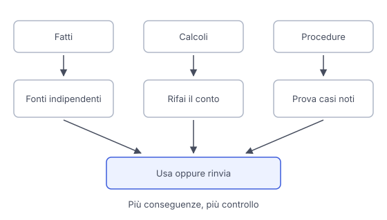

# IT

## In una frase

Verifica le affermazioni importanti con prove indipendenti e controlli adatti al compito, dedicando più attenzione agli errori dalle conseguenze maggiori.

## Approfondimento

Prima di usare una risposta, separa fatti, calcoli e proposte. Individua le affermazioni da cui dipende la tua decisione. Per i fatti cerca fonti pertinenti, aggiornate e possibilmente originali. Un confronto è davvero **indipendente** quando aggiunge prove, non quando un secondo sito copia il primo. Se due fonti discordano, controlla date, definizioni e ambito prima di scegliere.

Per calcoli e procedure verifica dati iniziali, unità e passaggi controllabili. Rifai un conto con una calcolatrice o confronta una procedura con le istruzioni originali. Chiedere una spiegazione può rendere visibile un errore, ma anche i passaggi scritti dal modello possono essere sbagliati. Prova inoltre casi semplici di cui conosci il risultato. Superarli conferma il risultato solo per quei casi.

Proporziona lo sforzo alle conseguenze. Un titolo per una festa richiede poco controllo, un'istruzione che riguarda la sicurezza molto di più, anche con una persona qualificata. Se mancano prove sufficienti, lascia la conclusione aperta o rinvia l'azione. Un altro assistente può aiutare la revisione, ma il suo accordo non basta come verifica.

## Esempio for dummies

Un assistente adatta una ricetta da una teglia a due e prepara la lista della spesa. Controlli che le quantità siano state raddoppiate, che grammi e cucchiai non siano confusi e che un ingrediente presente due volte non venga contato male. Non raddoppi automaticamente il tempo di cottura: consulti la ricetta e controlli il risultato. Per un ospite allergico verifichi anche le etichette, perché le conseguenze cambiano.

## Errore comune

Chiedere "sei sicuro?" e considerare la seconda risposta una verifica indipendente. Una conferma può ripetere lo stesso errore. Serve un controllo che introduca informazioni nuove o metta davvero alla prova il risultato.

## Didascalia della figura

Fatti, calcoli e procedure richiedono controlli diversi prima di decidere se usare la risposta o rinviare l'azione.

# EN

## One line

Check important claims using independent evidence and checks suited to the task, giving more attention to errors with greater consequences.

## Deep dive

Before using an answer, separate facts, calculations and suggestions. Identify the claims your decision depends on. For facts, seek relevant, current and preferably original sources. A comparison is truly **independent** when it adds evidence, not when a second website copies the first. If sources disagree, check dates, definitions and scope before choosing.

For calculations and procedures, check inputs, units and verifiable steps. Repeat a calculation with a calculator or compare a procedure with the original instructions. Asking for an explanation can expose an error, but the model's written steps can also be wrong. Try simple cases whose results you already know. Passing them provides evidence limited to those cases.

Match effort to consequences. A party title needs little checking, while an instruction affecting safety needs much more, including a qualified person. If sufficient evidence is missing, leave the conclusion open or postpone action. Another assistant can help with review, but its agreement alone is not verification.

## For dummies

An assistant scales a recipe from one baking tray to two and prepares a shopping list. You check that quantities have doubled, that grams and spoonfuls are not confused and that an ingredient appearing twice is not miscounted. You do not automatically double cooking time: you consult the recipe and check the result. For a guest with an allergy, you also check labels because the consequences change.

## Common mistake

Asking "are you sure?" and treating the second answer as independent verification. A confirmation can repeat the same error. You need a check that introduces new information or actually tests the result.

## Figure caption

Facts, calculations and procedures need different checks before deciding whether to use the answer or postpone action.
