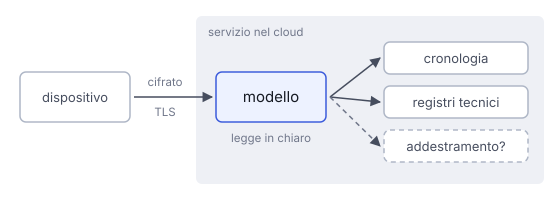

# IT

## In una frase

Il messaggio a un assistente nel cloud viaggia cifrato fino al servizio, dove il modello lo legge in chiaro e spesso viene registrato.

## Approfondimento

Quando premi invio, il dispositivo manda al servizio più del testo che vedi: gli allegati, la parte di conversazione che serve come contesto, e dati tecnici come indirizzo IP, ora e tipo di dispositivo. Il viaggio è di solito protetto dalla **cifratura in transito**, con il protocollo TLS, lo stesso del lucchetto nel browser. Chi osserva la connessione non può leggere il contenuto protetto da TLS, ma può vedere metadati come indirizzi IP, orari e quantità di dati.

All'arrivo, però, il messaggio viene decifrato. Il modello deve leggere il testo per rispondere, quindi sul server il contenuto è in chiaro. Non è una cifratura end-to-end come in certe app di messaggistica: qui il servizio è uno dei due capi della conversazione.

Dopo la risposta il messaggio può restare in più posti: la cronologia che vedi, i registri tecnici per errori e sicurezza, a volte i dati usati per migliorare i modelli. Quali copie esistono, e per quanto, dipende dal servizio e dalle impostazioni. Conviene scrivere sapendo che il testo potrebbe essere conservato.

## Nella vita di tutti i giorni

Spedisci una lettera in una busta chiusa. Il postino la trasporta ma non può leggerla. La busta però è indirizzata a un ufficio, e lì qualcuno la apre per rispondere. L'ufficio può anche fare una fotocopia per l'archivio e annotare sul registro chi ha scritto e quando. La busta protegge il viaggio, non quello che succede dopo l'apertura.

## Errore comune

Si pensa che "cifrato" voglia dire che nessuno può leggere il messaggio. La cifratura in transito protegge solo il tragitto. Il servizio che risponde deve leggere il testo, e può conservarlo secondo le sue regole.

## Didascalia della figura

Il messaggio viaggia cifrato fino al servizio, dove il modello lo legge in chiaro e una copia può finire in cronologia, nei registri o nei dati di addestramento.

# EN

## One line

Your message to a cloud assistant travels encrypted to the service, where the model reads it in plain text and it is often logged.

## Deep dive

When you press send, your device passes the service more than the text you see: attachments, the part of the conversation needed as context, and technical data such as IP address, time and device type. The trip is usually protected by **encryption in transit**, using the TLS protocol, the same one behind the padlock in your browser. Anyone watching the connection cannot read the content protected by TLS, but can see metadata such as IP addresses, times and amounts of data.

On arrival, though, the message is decrypted. The model has to read the text to answer, so on the server the content is in plain text. This is not end-to-end encryption as in some messaging apps: here the service is one of the two ends of the conversation.

After the answer, the message can stay in several places: the history you see, technical logs for errors and security, sometimes the data used to improve models. Which copies exist, and for how long, depends on the service and your settings. It pays to write knowing the text may be kept.

## In everyday life

You post a letter in a sealed envelope. The postman carries it but cannot read it. The envelope, however, is addressed to an office, and there someone opens it to reply. The office may also photocopy it for the archive and note in a register who wrote and when. The envelope protects the trip, not what happens once it is opened.

## Common mistake

People think "encrypted" means nobody can read the message. Encryption in transit only protects the trip. The service that answers has to read the text, and may keep it under its own rules.

## Figure caption

The message travels encrypted to the service, where the model reads it in plain text and a copy may end up in history, logs or training data.
