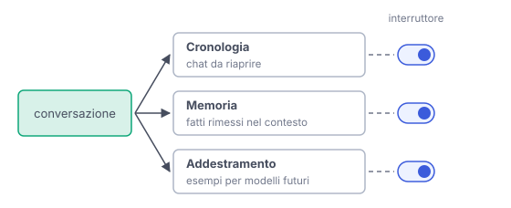

# IT

## In una frase

Cronologia, memoria e addestramento sono tre usi diversi delle tue conversazioni, con effetti diversi e spesso con impostazioni separate.

## Approfondimento

La **cronologia** è l'archivio delle chat che puoi riaprire. La memoria è un'altra cosa: il servizio salva alcuni fatti, come preferenze o progetti in corso, e li rimette nel contesto delle conversazioni future. Il modello resta identico e legge solo un appunto salvato (vedi Memoria degli agenti). L'addestramento, infine, usa le conversazioni come esempi per costruire versioni future del modello.

Confonderli porta a errori pratici. Cancellare una chat può non cancellare un fatto già finito in memoria. Escludere i dati dall'addestramento non svuota la cronologia. E una chat temporanea, che non compare in cronologia, può comunque restare per un periodo sui server, per esempio per controlli di sicurezza.

Molti servizi offrono un comando per ciascun uso: chat temporanee, una pagina per vedere e cancellare le memorie, un'opzione per escludere i propri dati dall'addestramento. Nomi e impostazioni predefinite cambiano tra servizi e tipi di account, anche nel tempo. Vale la pena controllarli uno per uno.

## Esempio for dummies

In palestra il registro degli ingressi segna ogni volta che passi: è la cronologia. L'allenatore si appunta che hai male a un ginocchio e lo rilegge prima di ogni lezione: è la memoria. La palestra studia le schede di tanti iscritti per scrivere il nuovo programma per tutti: è l'addestramento. Strappare una pagina del registro non cancella l'appunto dell'allenatore, né il programma già scritto.

## Errore comune

Si crede che cancellare una conversazione cancelli tutto ciò che ne deriva. Cronologia, memoria e dati per l'addestramento seguono regole e comandi separati. Ognuno va controllato per conto suo.

## Didascalia della figura

Una conversazione può prendere tre strade diverse, cronologia, memoria e addestramento, e ognuna ha il suo interruttore.

# EN

## One line

History, memory and training are three different uses of your conversations, with different effects and often with separate settings.

## Deep dive

**History** is the archive of chats you can reopen. Memory is something else: the service saves some facts, such as preferences or ongoing projects, and puts them back into the context of future conversations. The model stays the same and only reads a saved note (see Agent Memory). Training, finally, uses conversations as examples to build future versions of the model.

Mixing them up leads to practical mistakes. Deleting a chat may not delete a fact that already went into memory. Excluding your data from training does not empty your history. And a temporary chat, which never shows up in history, may still stay on the servers for a while, for example for safety checks.

Many services offer one control for each use: temporary chats, a page to view and delete memories, an option to exclude your data from training. Names and default settings vary across services and account types, and over time. It is worth checking them one by one.

## For dummies

At the gym, the entry register records every visit: that is history. The coach notes that your knee hurts and rereads it before each session: that is memory. The gym studies the records of many members to write the new programme for everyone: that is training. Tearing a page out of the register does not erase the coach's note, nor the programme already written.

## Common mistake

People believe deleting a conversation deletes everything that came from it. History, memory and training data follow separate rules and controls. Each one has to be checked on its own.

## Figure caption

A conversation can take three different paths, history, memory and training, and each has its own switch.
