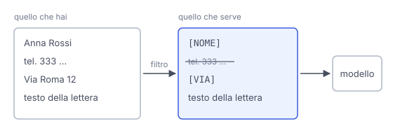

# IT

## In una frase

Dai al modello solo i dati che servono al compito: meno informazioni personali condividi, meno possono finire in registri, memorie o errori.

## Approfondimento

La **minimizzazione dei dati** è un principio della protezione dei dati: usare solo informazioni adeguate, pertinenti e limitate a quanto serve per lo scopo. Il regolamento europeo GDPR la mette tra i principi che chi tratta dati personali deve rispettare (articolo 5). Funziona bene anche come abitudine personale quando scrivi a un assistente.

In pratica, chiediti cosa serve davvero al compito. Per migliorare il tono di una lettera al condominio non servono nomi, indirizzo e telefono: bastano segnaposto come [NOME] o [VIA]. Per un riassunto non serve incollare l'intero documento se basta un capitolo. Spesso puoi descrivere la situazione in generale invece di incollare dati veri. Vale ancora di più per i dati di altre persone, che non hanno scelto di condividerli.

Il compromesso è con la qualità. Se togli troppo, la risposta diventa generica. Se il compito riguarda proprio un dettaglio, quel dettaglio serve. L'obiettivo non è dare il meno possibile in assoluto, ma niente oltre il necessario.

## Nella vita di tutti i giorni

Dal ferramenta, per comprare la vite giusta porti la vite vecchia, non l'intero armadio. Il commesso ha tutto ciò che gli serve e l'armadio resta a casa. Se però il problema è un'anta che non si chiude, la vite da sola non basta: allora porti una foto della cerniera. Porti ciò che serve alla domanda, non tutto ciò che hai.

## Errore comune

Si pensa che più contesto dia sempre risposte migliori, quindi si incolla tutto. Il contesto utile migliora la risposta, quello superfluo aggiunge rischi e rumore. Spesso i segnaposto al posto dei dati veri funzionano altrettanto bene.

## Didascalia della figura

Prima di inviare, i dati che non servono al compito vengono tolti o sostituiti con segnaposto, così al modello arriva solo il necessario.

# EN

## One line

Give the model only the data the task needs: the less personal information you share, the less can end up in logs, memories or mistakes.

## Deep dive

**Data minimisation** is a data protection principle: use only information that is adequate, relevant and limited to what the purpose needs. The European GDPR lists it among the principles that anyone processing personal data must respect (Article 5). It also works well as a personal habit when you write to an assistant.

In practice, ask what the task really needs. To improve the tone of a letter to your building's residents you do not need names, address and phone number: placeholders like [NAME] or [STREET] are enough. For a summary you do not need to paste the whole document if one chapter will do. Often you can describe the situation in general terms instead of pasting real data. This matters even more for other people's data, since they never chose to share it.

The trade-off is with quality. Remove too much and the answer turns generic. If the task is about one specific detail, that detail is needed. The goal is not the absolute minimum, but nothing beyond what is necessary.

## In everyday life

At the hardware shop, to buy the right screw you bring the old screw, not the whole wardrobe. The clerk has everything they need and the wardrobe stays at home. If the problem is a door that will not close, though, the screw alone is not enough: then you bring a photo of the hinge. You bring what the question needs, not everything you have.

## Common mistake

People think more context always gives better answers, so they paste everything. Useful context improves the answer, while extra context adds risk and noise. Placeholders instead of real data often work just as well.

## Figure caption

Before sending, data the task does not need is removed or replaced with placeholders, so only what is necessary reaches the model.
