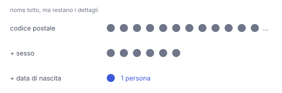

# IT

## In una frase

Togliere il nome non rende anonimi i dati: pochi dettagli combinati, come codice postale, sesso e data di nascita, spesso bastano a riconoscere una persona.

## Approfondimento

Un dato è davvero anonimo solo se non permette più, con mezzi ragionevoli, di risalire a una persona. Togliere il nome di solito non basta. Usando il censimento USA del 1990, la ricercatrice Latanya Sweeney stimò che circa l'87% della popolazione era probabilmente unica per la sola combinazione di codice postale, sesso e data di nascita. Dettagli così si chiamano **quasi-identificatori**: innocui da soli, rivelatori insieme.

La re-identificazione avviene incrociando fonti. In un altro studio noto, due ricercatori riconobbero alcuni utenti in un archivio di voti a film pubblicato senza nomi, confrontandolo con recensioni pubbliche firmate. Per questo il GDPR considera dati personali anche quelli pseudonimizzati, cioè con il nome sostituito da un codice, se con informazioni aggiuntive si può risalire alla persona.

Con un assistente AI vale lo stesso. "La nuova maestra di 34 anni della scuola di un paesino" può indicare una persona sola anche senza nome. Prima di incollare un testo togli o generalizza i dettagli rari: età esatte, luoghi piccoli, date, ruoli unici.

## Esempio for dummies

Il giornale di un paese scrive: "un idraulico di quarant'anni, con un cane a tre zampe, ha vinto la gara di torte". Niente nome, ma tutto il paese sa chi è. Ogni dettaglio da solo è comune: tanti idraulici, tanti quarantenni, qualche cane a tre zampe. Insieme formano un identikit. Gli archivi "anonimi" funzionano allo stesso modo: il pericolo sta nella combinazione.

## Errore comune

Si pensa che sostituire il nome con un codice o con "il signor X" renda i dati anonimi. Se restano dettagli rari, o combinabili con altre fonti, la persona si può ritrovare. Bisogna togliere o generalizzare anche quelli.

## Didascalia della figura

Ogni dettaglio da solo descrive molte persone, ma la combinazione di pochi dettagli può restringere il gruppo a una persona sola.

# EN

## One line

Removing the name does not make data anonymous: a few combined details, like postcode, sex and birth date, often single out a person.

## Deep dive

Data is truly anonymous only if it no longer lets anyone, by reasonable means, trace it back to a person. Removing the name is usually not enough. Using the 1990 US census, researcher Latanya Sweeney estimated that about 87% of the population was probably unique on the combination of ZIP code, sex and date of birth alone. Details like these are called **quasi-identifiers**: harmless alone, revealing together.

Re-identification works by linking sources. In another well-known study, two researchers recognised some users in a film-ratings dataset published without names, by matching it against public signed reviews. This is why the GDPR still treats pseudonymised data, where the name is swapped for a code, as personal data when extra information can link it back to the person.

The same applies with an AI assistant. "The new 34-year-old teacher at a village school" may point to exactly one person, no name needed. Before pasting a text, remove or blur the rare details: exact ages, small places, dates, unique roles.

## For dummies

A village paper reports: "a forty-year-old plumber with a three-legged dog won the cake contest". No name, yet the whole village knows who it is. Each detail alone is common: plenty of plumbers, plenty of forty-year-olds, a few three-legged dogs. Together they make an identikit. "Anonymous" datasets work the same way: the danger lies in the combination.

## Common mistake

People think swapping the name for a code or "Mr X" makes data anonymous. If rare details remain, or details that can be matched with other sources, the person can be found again. Those have to be removed or blurred too.

## Figure caption

Each detail alone describes many people, but a combination of a few details can narrow the group down to a single person.
