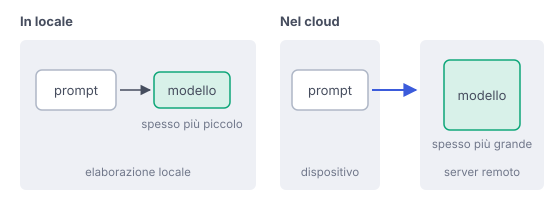

# IT

## In una frase

Un modello locale elabora il prompt sul tuo dispositivo, un servizio cloud su server remoti di solito più potenti: la riservatezza dipende anche dall'app.

## Approfondimento

Con un modello **in locale** i pesi sono scaricati sul tuo computer o telefono e il calcolo avviene lì. Il prompt non deve viaggiare verso un server per essere elaborato, e il modello funziona anche senza connessione. Con un servizio nel cloud il prompt viene inviato a computer remoti, che lo elaborano e rispondono (vedi Il viaggio di un messaggio).

Il cloud ha dalla sua la potenza: modelli più grandi e veloci, spesso con strumenti come la ricerca sul web, senza pesare sul tuo dispositivo. In locale la dimensione del modello è limitata dalla memoria e dal processore che hai. Di solito si usano quindi modelli più piccoli, spesso quantizzati, che sanno meno cose e reggono peggio i compiti lunghi.

Due cautele. Locale non vuol dire automaticamente privato: l'applicazione attorno al modello può inviare statistiche d'uso, sincronizzare le chat o cercare online, quindi conviene controllarla. E in locale la sicurezza è compito tuo: aggiornamenti, backup, protezione del dispositivo. Molti scelgono una via di mezzo: locale per i testi delicati, cloud per il resto.

## Esempio for dummies

Le lenzuola puoi lavarle in casa o portarle in lavanderia. In casa nessuno vede la tua biancheria, ma la lavatrice è piccola e il piumone non ci entra. La lavanderia ha macchine enormi e lava tutto, anche i capi difficili. In cambio la tua biancheria passa per le mani di altri, con le loro regole su chi la tocca e quanto resta in negozio.

## Errore comune

Si pensa che un'app con un modello locale sia per forza privata. Il modello può girare sul dispositivo mentre l'app invia dati d'uso, sincronizza le chat o cerca sul web. Conta tutto il sistema, non solo dove gira il modello.

## Didascalia della figura

Il modello locale elabora il prompt sul dispositivo, quello nel cloud su server remoti, mentre la riservatezza dipende anche dall'applicazione.

# EN

## One line

A local model processes the prompt on your device, a cloud service on usually more powerful remote servers: privacy also depends on the app.

## Deep dive

With a **local** model, the weights are downloaded to your computer or phone and the computation happens there. The prompt does not have to travel to a server to be processed, and the model works even offline. With a cloud service, the prompt is sent to remote computers that process it and reply (see A message's journey).

The cloud's strength is power: bigger, faster models, often with tools like web search, without loading your device. Locally, model size is capped by the memory and processor you have. So people usually run smaller models, often quantized, that know less and cope worse with long tasks.

Two caveats. Local does not automatically mean private: the app around the model may send usage statistics, sync your chats or search online, so it is worth checking. And with local, security is your job: updates, backups, protecting the device. Many people choose a middle way: local for sensitive texts, cloud for the rest.

## For dummies

You can wash your sheets at home or take them to the laundry. At home nobody sees your linen, but the machine is small and the duvet will not fit. The laundry has huge machines and washes everything, even the tricky items. In exchange, your linen passes through other people's hands, under their rules on who touches it and how long it stays in the shop.

## Common mistake

People think an app with a local model must be private. The model can run on the device while the app sends usage data, syncs chats or searches the web. What counts is the whole system, not just where the model runs.

## Figure caption

The local model processes the prompt on the device, the cloud one on remote servers, while privacy also depends on the app.
