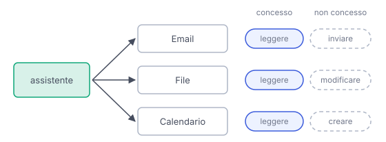

# IT

## In una frase

Collegare email, file o calendario dà all'assistente accesso a quei dati e a volte il potere di agire: concedi solo i permessi necessari.

## Approfondimento

Un connettore collega l'assistente a un altro servizio. Di solito lo autorizzi da una schermata di consenso che elenca i permessi, detti scope: leggere le email, inviarle, modificare file, creare eventi. Spesso il connettore riceve un "pass" valido solo per quei permessi, senza conoscere la tua password. Da quel momento l'assistente può leggere tutto ciò che il permesso copre, non solo i dati del compito di oggi.

Il **principio del minimo privilegio** dice di dare a ogni persona o programma solo i permessi necessari. Qui conta doppio. Email e file letti dall'assistente possono contenere istruzioni nascoste (vedi Prompt injection). Se l'assistente può anche inviare o cancellare, un inganno diventa un danno reale.

In pratica: preferisci la sola lettura quando basta, limita l'accesso a una cartella o a un calendario se il servizio lo permette, chiedi una conferma prima delle azioni importanti. E rivedi ogni tanto i collegamenti attivi: un accesso che non usi più va revocato.

## Esempio for dummies

Prima delle vacanze lasci al vicino le chiavi per bagnare le piante. Gli dai quella del portone e del balcone, non quella della cantina e dell'auto. Se ti fidi, va benissimo. Ma se qualcuno lo convince con un biglietto falso a "prendere un pacco in camera", meno porte apre la sua chiave, meno danni può fare. Al ritorno, le chiavi te le fai ridare.

## Errore comune

Si pensa che l'assistente legga solo ciò che gli chiedi. Con un connettore attivo può accedere a tutto ciò che il permesso concede, per esempio l'intera casella di posta. Il limite reale è il permesso, non la domanda.

## Didascalia della figura

Ogni connettore apre solo le porte che autorizzi: leggere è un permesso, inviare o modificare è un altro, più rischioso.

# EN

## One line

Connecting email, files or a calendar gives an assistant access to that data and sometimes the power to act: grant only the permissions needed.

## Deep dive

A connector links the assistant to another service. You usually authorise it on a consent screen that lists the permissions, called scopes: read email, send it, edit files, create events. Often the connector receives a "pass" valid only for those permissions, without ever learning your password. From then on, the assistant can read everything the permission covers, not just the data for today's task.

The **principle of least privilege** says to give every person or program only the permissions they need. Here it counts twice. Emails and files the assistant reads can hide instructions (see Prompt Injection). If the assistant can also send or delete, a trick becomes real damage.

In practice: prefer read-only access when it is enough, limit access to one folder or calendar if the service allows it, and ask for confirmation before important actions. Also review your active connections now and then: access you no longer use should be revoked.

## For dummies

Before going on holiday you leave your neighbour the keys to water the plants. You hand over the front door and balcony keys, not the cellar or the car. If you trust them, fine. But if someone talks them into "fetching a parcel from the bedroom" with a fake note, the fewer doors their keys open, the less harm they can do. When you get back, you ask for the keys back.

## Common mistake

People think the assistant reads only what they ask about. With a connector switched on, it can reach everything the permission grants, for example the whole mailbox. The real limit is the permission, not the question.

## Figure caption

Each connector opens only the doors you authorise: reading is one permission, sending or editing is another, riskier one.
