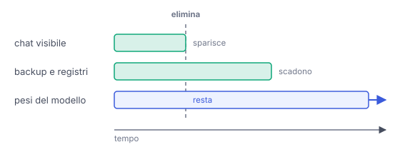

# IT

## In una frase

Cancellare toglie un dato dalla vista, ma backup e registri spariscono solo col tempo, e ciò che un modello ha imparato è difficile da togliere.

## Approfondimento

Ogni servizio decide per quanto tempo tenere i dati: è la **conservazione** (retention). Norme come il GDPR europeo chiedono di non tenere i dati personali più del necessario e, in molti casi, di cancellarli su richiesta. Quando premi "elimina", però, di solito sparisce prima la copia che vedi. Backup e registri tecnici vengono sovrascritti con i loro tempi, e obblighi di legge o contenziosi possono imporre di tenere certi dati più a lungo.

Con l'addestramento il problema cambia natura. Un modello non contiene un archivio delle conversazioni: ciò che ha imparato è sparso in miliardi di parametri, e non c'è una riga da cancellare. Il modo sicuro per togliere un esempio è riaddestrare il modello senza quel dato, cosa molto costosa. Le tecniche di machine unlearning cercano scorciatoie, ma sono ancora un campo di ricerca aperto.

E a volte i modelli memorizzano: alcuni studi hanno estratto da modelli linguistici brani testuali dei dati di addestramento, compresi nomi e indirizzi email. Per questo conta decidere prima cosa condividere, non dopo.

## Nella vita di tutti i giorni

Lo zucchero, finché è nel barattolo, puoi toglierlo quando vuoi. Una volta mescolato nell'impasto e cotto nella torta, non c'è modo di ripescarlo: dovresti rifare la torta da capo. Una conversazione salvata è come lo zucchero nel barattolo: si può cancellare. Una conversazione già usata per addestrare un modello è come lo zucchero nella torta.

## Errore comune

Si pensa che "elimina" faccia sparire il dato all'istante e ovunque. Di solito sparisce subito dalla vista, mentre backup e registri vengono cancellati più tardi. E un modello già addestrato con quel dato non cambia da solo.

## Didascalia della figura

Dopo l'eliminazione la chat visibile sparisce subito, backup e registri scadono più tardi, mentre ciò che è finito nei pesi del modello resta.

# EN

## One line

Deleting removes data from view, but backups and logs disappear only over time, and what a model has learned is hard to remove.

## Deep dive

Every service decides how long to keep data: this is **retention**. Laws such as the European GDPR require personal data not to be kept longer than necessary and, in many cases, to be erased on request. When you press "delete", though, the copy you see usually goes first. Backups and technical logs are overwritten on their own schedule, and legal duties or disputes can require some data to be kept longer.

With training, the problem changes nature. A model does not hold an archive of conversations: what it learned is spread across billions of parameters, and there is no row to delete. The sure way to remove an example is to retrain the model without it, which is very expensive. Machine unlearning techniques look for shortcuts, but they are still an open research field.

And models sometimes memorise: some studies have extracted verbatim passages of training data from language models, including names and email addresses. That is why deciding what to share matters before, not after.

## In everyday life

Sugar in the jar can be taken out whenever you like. Once it is stirred into the batter and baked into the cake, there is no fishing it out: you would have to bake the cake again from scratch. A saved conversation is like sugar in the jar: it can be deleted. A conversation already used to train a model is like the sugar in the cake.

## Common mistake

People think "delete" makes data vanish instantly and everywhere. It usually vanishes from view at once, while backups and logs are erased later. And a model already trained on that data does not change by itself.

## Figure caption

After deletion the visible chat disappears at once, backups and logs expire later, while whatever went into the model's weights stays.
