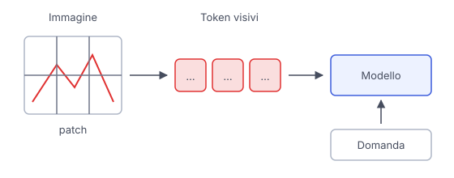

# IT

## In una frase

Un modello visivo trasforma l'immagine in rappresentazioni numeriche, utili per riconoscere scene ma non sempre affidabili sui dettagli.

## Approfondimento

Molti modelli visivi dividono l'immagine in **patch**, piccoli riquadri. Ogni riquadro diventa un vettore di numeri, un token visivo, insieme a informazioni sulla posizione. Il modello combina questi token per riconoscere relazioni fra le parti. Non sono parole di un vocabolario: una patch può contenere pezzi di più oggetti, e un oggetto può occupare molte patch.

In un sistema che risponde a domande sulle immagini, queste rappresentazioni vengono collegate al testo della richiesta. Questo permette di descrivere una cucina, riconoscere una bicicletta o spiegare una scena. Il modello sfrutta anche le regolarità apprese, quindi può descrivere un dettaglio plausibile che nella foto non c'è.

Contare oggetti simili e leggere scritte minuscole può essere difficile. Ridimensionare l'immagine può perdere dettagli, e riconoscere una scena non equivale a misurarla con precisione. Un ritaglio nitido della zona utile può aiutare, ma numeri e testi importanti vanno confrontati con l'originale.

## Esempio for dummies

Porti la foto di uno scaffale a un amico e gli chiedi cosa contiene. Da lontano distingue libri, una pianta e una lampada. Per leggere il titolo sul dorso di un libro deve avvicinarsi. Un modello può dare una buona descrizione generale e sbagliare proprio quel titolo, anche se risponde con la stessa sicurezza in entrambi i casi.

## Errore comune

Pensare che una descrizione corretta della scena garantisca ogni dettaglio. Riconoscere una tavola apparecchiata non dimostra di saper contare tutti i bicchieri o leggere una scritta piccola sul menu.

## Didascalia della figura

L'immagine divisa in patch diventa una sequenza di token visivi che il modello combina con la domanda.

# EN

## One line

A vision model turns an image into numerical representations that help it recognize scenes but do not guarantee accurate details.

## Deep dive

Many vision models divide an image into **patches**, small tiles. Each tile becomes a vector of numbers, a visual token, accompanied by position information. The model combines these tokens to recognize relationships between parts. They are not words from a vocabulary: one patch may contain pieces of several objects, and one object may span many patches.

In a system that answers questions about images, these representations connect to the text of the request. This makes it possible to describe a kitchen, recognize a bicycle or explain a scene. The model also draws on learned patterns, so it may describe a plausible detail that is absent from the photo.

Counting similar objects and reading tiny text can be difficult. Resizing an image can lose detail, and recognizing a scene is different from measuring it precisely. A clear crop of the relevant area may help, but important counts and text need checking against the original.

## For dummies

You show a friend a photo of a shelf and ask what it holds. From a distance, they can distinguish books, a plant and a lamp. To read a book's title on its spine, they need a closer look. A model may give a good overall description and get that very title wrong, while sounding equally confident about both.

## Common mistake

Assuming that a correct scene description guarantees every detail. Recognizing a table set for dinner does not demonstrate an ability to count every glass or read tiny writing on the menu.

## Figure caption

An image split into patches becomes a sequence of visual tokens that the model combines with the question.
