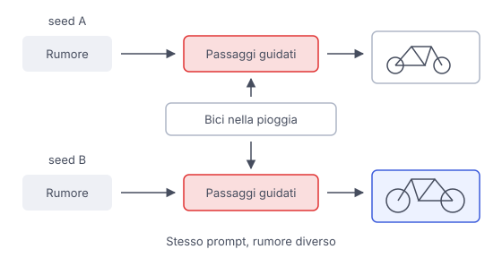

# IT

## In una frase

Nei generatori a diffusione, il prompt orienta la trasformazione di rumore casuale in un'immagine compatibile con la descrizione.

## Approfondimento

Nei generatori a **diffusione**, il punto di partenza è rumore casuale, spesso in una rappresentazione compressa dell'immagine. Il modello lo trasforma gradualmente in una struttura riconoscibile. Il testo viene convertito in rappresentazioni numeriche che guidano i passaggi: “una bicicletta sotto la pioggia” orienta soggetto e ambiente. Per il meccanismo di base, vedi Modelli di diffusione.

La descrizione ammette molte immagini possibili. Cambiando il rumore iniziale possono cambiare inquadratura, dettagli e composizione, anche se il prompt resta identico. Il seed è il numero che inizializza il generatore di numeri pseudocasuali. Fissarlo permette di controllare una fonte di variabilità quando si confrontano due tentativi.

Il seed non è una fotografia salvata. Per ripetere un risultato servono anche lo stesso modello, le stesse impostazioni e condizioni di esecuzione compatibili. Differenze nel software o nell'hardware possono impedire una copia identica. Conviene conservare l'immagine riuscita insieme al prompt e alle impostazioni.

## Esempio for dummies

Chiedi a due illustratori una bicicletta sotto la pioggia. Uno la mette davanti a una scuola, l'altro vicino a un albero. Entrambi rispettano la richiesta, perché molte scelte restano aperte. Nel generatore, il rumore casuale contribuisce a queste differenze. Conservare il seed aiuta a ripartire in condizioni simili, ma serve anche conservare il resto della “ricetta”.

## Errore comune

Credere che lo stesso prompt debba produrre la stessa immagine. La richiesta lascia aperti molti dettagli e il processo usa casualità. Anche un seed uguale non basta se cambiano modello o impostazioni.

## Didascalia della figura

Lo stesso prompt guida due percorsi dal rumore all'immagine, con risultati diversi quando cambia il seed.

# EN

## One line

In diffusion generators, the prompt guides the transformation of random noise into an image consistent with the description.

## Deep dive

In **diffusion** generators, the starting point is random noise, often in a compressed image representation. The model gradually transforms it into recognizable structure. Text becomes numerical representations that guide the steps: “a bicycle in the rain” steers the subject and setting. For the underlying mechanism, see Diffusion models.

The description allows many possible images. Changing the initial noise can change the framing, details and composition even when the prompt stays identical. A seed is the number that initializes the pseudorandom number generator. Fixing it lets you control one source of variation when comparing two attempts.

A seed is not a saved photograph. Repeating a result also requires the same model, the same settings and compatible execution conditions. Software or hardware differences can prevent an identical copy. Keep a successful image together with its prompt and settings.

## For dummies

You ask two illustrators for a bicycle in the rain. One puts it outside a school, the other beside a tree. Both follow the request, because many choices remain open. In a generator, random noise contributes to these differences. Keeping the seed helps you start again under similar conditions, but you also need the rest of the “recipe”.

## Common mistake

Believing that the same prompt must produce the same image. The request leaves many details open and the process uses randomness. Even an identical seed is insufficient when the model or settings change.

## Figure caption

The same prompt guides two paths from noise to image, producing different results when the seed changes.
