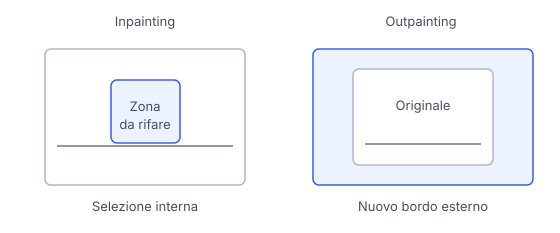

# IT

## In una frase

Una maschera indica dove generare nuovi contenuti, ma preservare esattamente il resto dipende dal metodo usato per applicare la modifica.

## Approfondimento

L'**inpainting** genera contenuti in una zona selezionata dell'immagine. La maschera è una mappa che indica l'area da modificare. Il modello usa il prompt e il contesto circostante per proporre un riempimento compatibile: può sostituire una tazza oppure ricostruire lo sfondo dove si trovava. Non recupera automaticamente ciò che era nascosto dietro l'oggetto.

L'outpainting applica un'idea simile oltre i bordi originali. Si allarga la tela e si generano le parti mancanti, cercando continuità di prospettiva, luce e contenuto. Il paesaggio aggiunto è una continuazione plausibile, non una porzione ritrovata della fotografia.

La maschera non garantisce sempre che ogni pixel esterno resti identico. Alcuni procedimenti ricostruiscono anche il contesto o sfumano il confine, introducendo variazioni. Se serve conservarlo esattamente, occorre un metodo che ricomponga la parte modificata sull'originale. Confronta il risultato completo, soprattutto vicino ai bordi della selezione.

## Nella vita di tutti i giorni

Hai una foto della cucina con una tazza sul tavolo. Selezioni la tazza e chiedi una ciotola. Il sistema deve inventare anche il bordo nascosto del tavolo e un'ombra credibile. Se invece allarghi la foto verso destra, deve inventare altra cucina. In entrambi i casi guardi anche piastrelle e tovaglia, perché una modifica riuscita al centro può nascondere piccoli cambiamenti intorno.

## Errore comune

Pensare che cancellare un oggetto riveli la scena vera che copriva. Il modello genera un riempimento plausibile usando il contesto. Senza altre informazioni, non può sapere cosa fosse realmente nascosto.

## Didascalia della figura

L'inpainting modifica una zona interna selezionata, mentre l'outpainting genera nuove zone oltre il bordo originale.

# EN

## One line

A mask marks where new content should be generated, but preserving everything else exactly depends on how the edit is applied.

## Deep dive

**Inpainting** generates content inside a selected image region. A mask is a map that marks the area to edit. The model uses the prompt and surrounding context to propose a compatible fill: it might replace a cup or reconstruct the background where it stood. It does not automatically recover what was hidden behind the object.

Outpainting applies a similar idea beyond the original borders. The canvas expands and missing areas are generated, aiming for continuity in perspective, lighting and content. An added landscape is a plausible continuation, not a recovered portion of the photograph.

A mask does not always guarantee that every outside pixel stays identical. Some methods also reconstruct context or blend the boundary, introducing changes. Exact preservation requires a method that composites the edited area onto the original. Compare the full result, especially around the selection's edges.

## In everyday life

You have a kitchen photo with a cup on the table. You select the cup and ask for a bowl. The system must also invent the hidden table edge and a plausible shadow. If you expand the photo to the right instead, it must invent more kitchen. In both cases, check the tiles and tablecloth too: a successful central edit can hide small changes nearby.

## Common mistake

Assuming that removing an object reveals the real scene it covered. The model generates a plausible fill from context. Without additional information, it cannot know what was actually hidden behind the object.

## Figure caption

Inpainting edits a selected interior area, while outpainting generates new areas beyond the original border.
