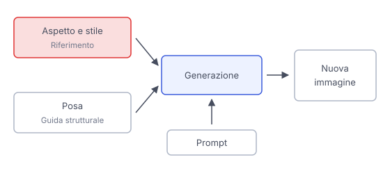

# IT

## In una frase

Un'immagine di riferimento guida la generazione con informazioni visive, ma soggetto, posa e stile richiedono controlli diversi.

## Approfondimento

Un'**immagine di riferimento** aggiunge informazioni che le parole descrivono con fatica. Il sistema ne estrae rappresentazioni numeriche e le usa insieme al prompt per guidare la generazione. Un riferimento può suggerire l'aspetto di un soggetto, i colori o il modo di disegnare. La sua influenza dipende dal metodo e dalle impostazioni disponibili.

Controllare la posa è un compito diverso dal mantenere lo stile. Alcuni metodi estraggono contorni, profondità o uno schema del corpo e usano quella struttura come guida. Altri trasferiscono caratteristiche visive più generali. Una foto di una persona seduta, quindi, non implica automaticamente che il sistema conservi volto, posizione e illuminazione insieme.

Specificare cosa mantenere e cosa cambiare rende il tentativo più valutabile. Una guida più forte può migliorare la somiglianza, ma limitare le variazioni desiderate o portare con sé dettagli indesiderati. Confronta separatamente identità del soggetto, disposizione e stile, senza trattare la somiglianza complessiva come una copia esatta.

## Nella vita di tutti i giorni

Vuoi disegnare il tuo cane come in un libro illustrato. Fornisci una sua foto per l'aspetto e una pagina dipinta per lo stile, se lo strumento accetta più riferimenti. Chiedi poi il cane sdraiato. Una bella pennellata non basta: controlli anche orecchie e macchie. Se la posa resta quella della foto, il riferimento ha vincolato anche qualcosa che volevi cambiare.

## Errore comune

Pensare che allegare una foto significhi “copia tutto tranne ciò che nomino”. Il riferimento orienta la generazione, ma non definisce da solo quali caratteristiche vadano mantenute identiche e quali possano cambiare.

## Didascalia della figura

Il riferimento di aspetto e stile e la guida di posa entrano nella generazione insieme al prompt.

# EN

## One line

A reference image guides generation with visual information, but subject, pose and style call for different controls.

## Deep dive

A **reference image** adds information that words struggle to describe. The system extracts numerical representations and uses them alongside the prompt to guide generation. A reference may suggest a subject's appearance, colors or drawing style. Its influence depends on the method and available settings.

Controlling pose is different from maintaining style. Some methods extract edges, depth or a body layout and use that structure as guidance. Others transfer broader visual features. A photo of a seated person therefore does not automatically mean the system will preserve their face, position and lighting together.

Stating what to keep and what to change makes an attempt easier to evaluate. Stronger guidance may improve resemblance, but restrict desired variations or carry over unwanted details. Compare subject identity, layout and style separately, without treating overall similarity as an exact copy.

## In everyday life

You want to draw your dog as a picture-book character. You provide a photo for its appearance and a painted page for the style, if the tool accepts multiple references. Then you ask for the dog lying down. Lovely brushwork is not enough: you check its ears and markings too. If the pose stays unchanged, the reference has constrained something you wanted to alter.

## Common mistake

Assuming that attaching a photo means “copy everything except what I mention”. A reference guides generation, but does not by itself specify which features must stay identical and which may change.

## Figure caption

An appearance and style reference and a pose guide feed into generation alongside the prompt.
