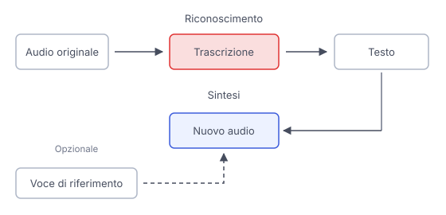

# IT

## In una frase

Il riconoscimento vocale stima le parole da un segnale audio, mentre la sintesi vocale genera parlato a partire dal testo.

## Approfondimento

Il **riconoscimento vocale**, o speech-to-text, trasforma una registrazione in testo. Il modello analizza caratteristiche del suono e usa le regolarità della lingua per stimare le parole pronunciate. Rumore, voci sovrapposte e nomi poco comuni possono rendere la trascrizione sbagliata anche quando la frase ottenuta sembra perfettamente sensata.

La sintesi vocale, o text-to-speech, fa il percorso opposto: genera un nuovo segnale audio dal testo, scegliendo pronuncia, ritmo e intonazione. Il testo da solo non contiene tutte le sfumature della registrazione originale. Una frase riletta può quindi suonare diversa anche quando le parole coincidono.

La clonazione vocale usa registrazioni di riferimento per riprodurre caratteristiche di una voce. La somiglianza non prova chi abbia pronunciato quelle parole. Per creare una voce clonata, chiedi il consenso della persona. Quando ricevi una richiesta insolita con una voce familiare, verifica l'identità attraverso un contatto indipendente.

## Esempio for dummies

Detti a casa un messaggio per l'allenatrice: “Chiedi a Nives di portare le racchette”. Il frullatore copre il nome e la trascrizione lo sostituisce con un altro. La lettura automatica pronuncia poi quel nome sbagliato in modo limpido e naturale. Una voce gradevole non corregge l'errore iniziale: prima di inviare il messaggio, controlli il nome nel testo.

## Errore comune

Confondere una voce naturale con una prova di autenticità. Un sistema può leggere un testo falso con una voce convincente, anche simile a quella di una persona reale che non ha mai pronunciato quelle parole.

## Didascalia della figura

Il riconoscimento produce una trascrizione dall'audio, mentre la sintesi genera nuovo audio dal testo, eventualmente guidata da una voce di riferimento.

# EN

## One line

Speech recognition estimates words from an audio signal, while speech synthesis generates spoken audio from text.

## Deep dive

**Speech recognition**, or speech-to-text, turns a recording into text. The model analyzes sound features and uses language patterns to estimate the words spoken. Noise, overlapping voices and uncommon names can produce an incorrect transcript even when the resulting sentence sounds perfectly reasonable.

Speech synthesis, or text-to-speech, goes the other way: it generates a new audio signal from text, choosing pronunciation, rhythm and intonation. Text alone does not contain every nuance of the original recording. A sentence read aloud again may therefore sound different even when its words match.

Voice cloning uses reference recordings to reproduce characteristics of a voice. Resemblance does not prove who spoke those words. Ask for a person's consent before creating a cloned voice. When an unusual request arrives in a familiar voice, verify the speaker's identity through an independent contact.

## For dummies

At home, you dictate a message for your coach: “Ask Nives to bring the rackets”. The blender drowns out the name, and the transcript replaces it with another one. The automatic reader then pronounces that wrong name clearly and naturally. A pleasant voice does not fix the original error: before sending the message, you check the name in the text.

## Common mistake

Mistaking a natural voice for proof of authenticity. A system can read false text in a convincing voice, including one resembling a real person who never actually spoke those words.

## Figure caption

Recognition produces a transcript from audio, while synthesis generates new audio from text, potentially guided by a reference voice.
