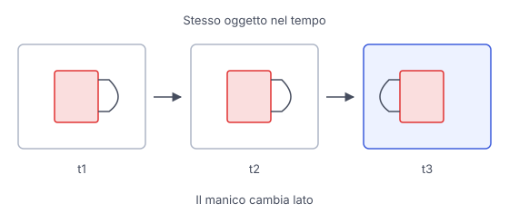

# IT

## In una frase

Generare video richiede immagini credibili e relazioni coerenti nel tempo, così che persone, oggetti e movimenti restino compatibili fra fotogrammi.

## Approfondimento

Un video contiene immagini ordinate nel tempo, chiamate **fotogrammi**. Generarle indipendentemente può produrre una sequenza incoerente. I modelli video devono collegare informazioni fra momenti diversi, usando ciò che hanno appreso sul movimento e sulla continuità delle scene. Alcuni estendono la diffusione a rappresentazioni che includono sia spazio sia tempo, guidate da testo o immagini.

La difficoltà è mantenere identità e relazioni mentre la scena cambia. Una persona si gira, una mano copre una tazza, la tazza ricompare. Il modello può modificarne la forma o perderla del tutto. Fotogrammi singolarmente convincenti non garantiscono un movimento possibile né una scena fisicamente corretta.

A parità delle altre condizioni, più durata e più fotogrammi richiedono generalmente più calcolo e memoria. Anche la risoluzione pesa, e i nuovi tentativi aumentano il costo complessivo. Per un progetto pratico conviene provare prima una scena breve e semplice, poi controllare l'intera sequenza e i passaggi difficili.

## Nella vita di tutti i giorni

Vuoi un breve video di una persona che prepara il tè. La tazza e l'inquadratura restano ferme. Il primo fotogramma mostra il manico a destra. Mentre la mano passa davanti, il manico sparisce e poi ricompare dall'altra parte. Ogni immagine potrebbe sembrare una bella fotografia, ma viste insieme raccontano un movimento incoerente. Controllare l'intera sequenza aiuta anche a trovare errori temporanei, assenti nel primo e nell'ultimo fotogramma.

## Errore comune

Pensare che un video sia soltanto tante immagini belle in fila. Serve anche coerenza fra quelle immagini: un oggetto deve mantenere caratteristiche e posizione compatibili con il movimento e con ciò che lo nasconde.

## Didascalia della figura

La tazza mantiene il manico nei primi fotogrammi, ma lo cambia nell'ultimo: un esempio di incoerenza nel tempo.

# EN

## One line

Video generation needs credible images and coherent relationships over time, so people, objects and movements remain consistent across frames.

## Deep dive

A video contains images ordered in time, called **frames**. Generating them independently can produce an incoherent sequence. Video models need to connect information across different moments, using learned patterns of motion and scene continuity. Some extend diffusion to representations that cover both space and time, guided by text or images.

The challenge is maintaining identity and relationships as the scene changes. A person turns, a hand covers a cup, the cup reappears. The model may alter its shape or lose it entirely. Individually convincing frames do not guarantee possible motion or a physically correct scene.

With other conditions held constant, longer duration and more frames generally require more computation and memory. Resolution matters too, and retries increase the overall cost. For a practical project, start with a short, simple scene, then check the whole sequence and its difficult transitions.

## In everyday life

You want a short video of someone making tea. The cup and camera remain still. The first frame shows the handle on the right. As a hand passes in front, the handle disappears and then returns on the other side. Each image might look like a fine photograph, but together they show inconsistent movement. Checking the whole sequence also helps reveal temporary errors absent from the first and last frames.

## Common mistake

Thinking a video is just a string of beautiful images. Those images also need consistency: an object must keep characteristics and positions compatible with its movement and with whatever hides it.

## Figure caption

The cup keeps its handle in the first frames but changes it in the last, illustrating inconsistency over time.
