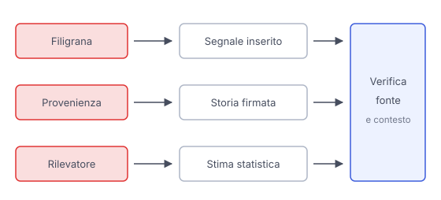

# IT

## In una frase

Filigrane, metadati e rilevatori offrono indizi diversi sull'origine di un contenuto, senza garantire da soli che ciò che racconta sia vero.

## Approfondimento

Una **filigrana invisibile** incorpora un segnale nel contenuto, per esempio nei pixel o nell'audio, riconoscibile da un lettore adatto. Può indicare l'origine sintetica se il sistema che genera il contenuto la inserisce. Non tutti lo fanno. Compressione e modifiche possono indebolire alcune filigrane, quindi la loro assenza non prova un'origine umana.

I metadati di provenienza descrivono invece la storia dichiarata del file. Lo standard aperto C2PA permette di legare dichiarazioni firmate al contenuto e verificarne l'integrità. Occorre comunque valutare chi firma e che cosa dichiara. Una firma valida non dimostra che la scena sia vera, e i metadati possono andare persi durante una condivisione.

I rilevatori di AI cercano tracce statistiche senza richiedere una dichiarazione del creatore. Possono segnalare contenuti autentici o non riconoscere quelli sintetici, soprattutto fuori dalle condizioni di valutazione. Usa il risultato come indizio, insieme alla fonte originale e ad altre conferme, non come verdetto.

## Esempio for dummies

Ricevi la foto di un albero caduto davanti alla scuola. Il file ha una scheda di provenienza valida, ma questo non dice se la foto sia di oggi o se la descrizione del luogo sia corretta. Cerchi il messaggio originale e una conferma della scuola. Se la scheda manca, fai gli stessi controlli: la sua assenza non dimostra che l'immagine sia generata.

## Errore comune

Credere che “nessuna filigrana” significhi “foto autentica”, oppure che un rilevatore possa certificare il falso. I segnali possono mancare e i rilevatori sbagliare. Anche una provenienza verificabile va distinta dalla verità del messaggio.

## Didascalia della figura

Filigrana e provenienza offrono informazioni sull'origine, mentre il rilevatore fornisce una stima che richiede ulteriori verifiche.

# EN

## One line

Watermarks, metadata and detectors offer different clues about a piece of content's origin, without individually guaranteeing that its message is true.

## Deep dive

An **invisible watermark** embeds a signal in content, such as pixels or audio, that a suitable reader can recognize. It may indicate synthetic origin if the generating system inserts it. Not all systems do. Compression and editing can weaken some watermarks, so their absence does not prove human origin.

Provenance metadata instead describes a file's declared history. The open C2PA standard lets signed statements be bound to content and checked for integrity. You still need to assess who signed and what they claim. A valid signature does not prove a scene is real, and metadata may be lost during sharing.

AI detectors look for statistical traces without requiring a creator's declaration. They may flag authentic content or miss synthetic content, especially outside their evaluation conditions. Treat the result as a clue alongside the original source and other confirmation, not as a verdict.

## For dummies

You receive a photo of a fallen tree outside the school. The file has a valid provenance record, but this does not tell you whether the photo is from today or the location description is correct. You look for the original post and confirmation from the school. If the record is missing, make the same checks: its absence does not prove the image was generated.

## Common mistake

Believing that “no watermark” means “authentic photo”, or that a detector can certify a fake. Signals may be missing and detectors can be wrong. Even verifiable provenance must be distinguished from a message's truth.

## Figure caption

A watermark and provenance offer information about origin, while a detector provides an estimate that needs further checking.
